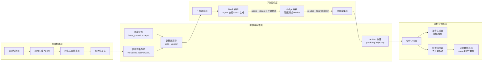
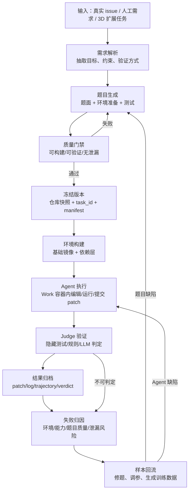
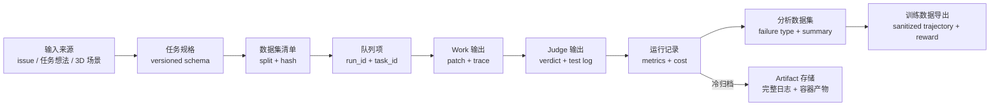
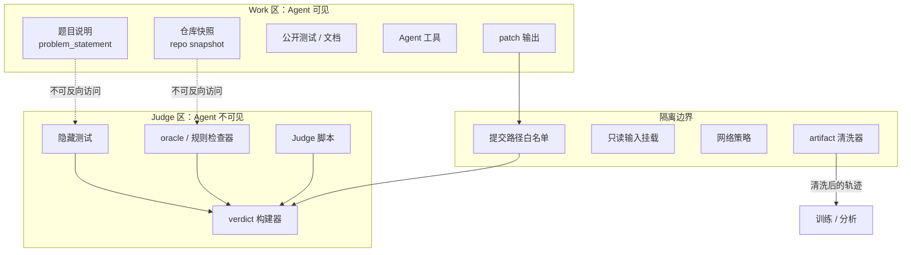

# SE-Bench 长程 Agent 评测基准工程复现技术设计文档

版本：v2.5
日期：2026-07-01
定位：面向工程复现、项目复盘、面试讲解与评审答辩

v1.1 更新重点：补充成熟开源项目经验映射、当前 GitHub 高赞项目优先级、高引用文献相关性排序、缓存命中率/准确率/成本指标体系、P0/P1/P2 工程改造路线和性能优化闭环。

v1.2 更新重点：新增真实评测闭环与 Mac MLX 本地 benchmark 预留方案，明确 Apple Silicon + MLX/Metal 可用于本地工程验证和优化复盘，但不能替代 CUDA/GPU 集群工业吞吐验收。

v1.3 更新重点：在独立开发副本 `sebench-ai-infra-replica-dev` 中完成 P0 toy true-loop 开发、Mac MLX 本地 benchmark、baseline/optimized 对比和工业化分析报告；实测结果显示 toy 闭环 pass rate 保持 1.0，repo snapshot/repo map cache hit 从 0 提升到 1.0。

v1.4 更新重点：完成 round2 测试，扩展到 7 个 toy task、35 条正式 RunRecord；实现 Judge verdict cache 与进程内 Python script Judge；安装并打通 PyTorch MPS，MLX/MPS sanity 均可运行。实测显示 pass rate 保持 1.0，judge verdict cache hit 从 0 提升到 1.0，toy Judge 平均耗时降到约 0.00000038s。Mac MLX/MPS 数据继续仅作为本地工程验证，不能替代 CUDA/GPU 集群工业吞吐验收。

v1.5 更新重点：完成 round3 仿真真实 repo 小样本验证，新增 `sebench-realistic-v0.1` 20 题 manifest 与 hidden inline tests；发现并修复 Python `sys.modules` 同名 package cache 污染问题。修复后 cold 20/20 pass，warm 100/100 pass；warm 后 snapshot/repo-map/judge verdict cache hit 均为 1.0，wall time p50/p95 为 0.001321s/0.001619s。

v1.6 更新重点：完成 round4 patch submission 验证，新增 `sebench-patch-v0.1` 20 题 manifest。Work 只提交 `submission/model.patch`，Judge 在 clean checkout 校验 patch 白名单并执行 `git apply --check` / `git apply` 后运行 hidden tests。修复后 cold 20/20 pass，warm 100/100 pass；cold patch apply 使 Judge avg 达到 0.033808s，warm verdict cache 命中后降到约 0.00000044s。

v1.7 更新重点：完成 round5 并发 runner 与时间拆分验证，新增 `--workers`、`--task-timeout-sec`、`patch_apply_time_sec`、`hidden_test_time_sec`、`judge_cache_lookup_time_sec`、run duration 和 throughput 指标。hidden inline tests 改为 subprocess 隔离以支持并发。workers=4 在 cold 下吞吐从 9.91 提升到 18.16 tasks/s，在 warm 下从 702.94 提升到 1274.63 tasks/s。

v1.8 更新重点：完成 round6 本地真实 git fixture + hidden pytest 验证，新增 `examples/git_pytest_benchmark.json` 128 题、`scripts/build_git_pytest_benchmark.py`、`scripts/run_worker_sweep.py` 和 64/128/256/1024 workers sweep。四组全部 pass rate 1.0；64 workers 为本轮 Mac 本地最佳点，吞吐 12.538914 tasks/s，继续加到 1024 workers 吞吐下降到 11.936008 tasks/s，说明本机已进入 pytest 子进程、文件系统 I/O 和调度饱和区。

v1.9 更新重点：完成 round7 hidden pytest + filesystem I/O 诊断与优化。新增 pytest startup/collection/execution、git clone/checkout、snapshot materialization、tempdir cleanup 等细粒度指标；新增 clone/worktree/copytree/tar checkout strategy A/B、1024-task manifest、诊断分析脚本和 `hidden_judge_timeout`。worktree + 锁拆分优化后，1024 tasks / 64 workers 吞吐从 clone baseline 10.817814 tasks/s 提升到 13.210426 tasks/s，repo checkout avg 从 0.433546s 降到 0.174422s，pass rate 保持 1.0。

v2.0 更新重点：完成 round8 独立 repeat 稳定性 sweep 与生产 cap 二次调整。修正 benchmark repeat 默认复用同一 orchestrator 导致 Judge verdict cache 放大吞吐的问题，新增 `--pressure-test`、`--pytest-timeout-sec`、`hidden_judge_timeout_count` 和默认 `worktree` strategy。独立 repeat、无 Judge verdict cache 污染后，1024 tasks / 8 workers 为当前 Mac cold path 最快稳定点：pass rate 1.0、timeout 0、吞吐 11.024153 tasks/s；64/96 workers 出现 hidden pytest timeout，普通 Mac 本地默认 cap 调整为 8，diagnostics 默认 cap 保持 32。

v2.1 更新重点：完成 round9 pytest plugin autoload 优化实验和源码开关。新增 `--disable-pytest-plugin-autoload` 与 `EvaluationOrchestrator(disable_pytest_plugin_autoload=True)`，在 hidden pytest subprocess 中设置 `PYTEST_DISABLE_PLUGIN_AUTOLOAD=1`。对当前本地 fixture，1024 tasks / 8 workers 吞吐从 11.024153 提升到 15.592737 tasks/s，pass rate 1.0、timeout 0；该阶段先以实验开关验证收益，round10 后已按实测改为本地 generated fixture 默认加速路径。

v2.2 更新重点：根据 round9/round10 实测直接开启 pytest plugin autoload 加速策略。`LocalSandbox`、`EvaluationOrchestrator`、`run_mac_mlx_benchmark.py` 和 `run_worker_sweep.py` 默认设置 `PYTEST_DISABLE_PLUGIN_AUTOLOAD=1`；外部项目如需 pytest 插件，可显式使用 `--enable-pytest-plugin-autoload` 或 `EvaluationOrchestrator(disable_pytest_plugin_autoload=False)` opt out。1024 tasks / 8 workers 默认路径 pass rate 1.0、timeout 0、吞吐 16.830750 tasks/s。

v2.3 更新重点：迁移到干净开发环境，清理 active dev copy 中的 venv、cache、pyc 和 per-worker 中间报告，仅保留源码、examples、docs、聚合报告和关键分析报告。新增 `pytest_plugin_policy=auto|disabled|enabled` 与 plugin dependency scan：auto 会扫描 repo 配置、hidden tests 和 pytest args，检测到插件依赖时自动 opt out；round11 小样本验证显示 policy fixture auto pass rate 1.0，generated git fixture 128-task auto pass rate 1.0 且 `auto_disabled=128`。

v2.4 更新重点：安装并打通 Torch MPS 到当前 `.venv-apple`，新增 hard task timeout、`--scheduler-policy fixed|adaptive`、`--soft-task-timeout` 和 repo-affinity worker cap。hard timeout 使用持久 worker process 执行本地任务，父进程可按 `task_timeout_sec` 强制 kill process group 并归因为 `task_timeout`。128-task sweep 显示 hard process isolation 的主要成本来自 process-local cache 碎片；生产默认路径按 repo affinity 将请求 32 workers 收敛到 4 workers，1024-task pass rate 1.0、timeout 0、吞吐 12.267360 tasks/s。Mac MPS/MLX 仍只作为本地工程验证，不代表 CUDA/GPU 集群吞吐。

v2.5 更新重点：完成 round13 shared cache + repo-shard scheduler 优化验证。新增 `cache_policy=auto|process|shared`、共享 checkout cache、file lock、`repo-shard-worksteal` 调度、cache lock/pytest subprocess/repo switch 指标，并将 shared cleanup 从每题 `git reset && git clean` 改为定向清理 hidden pytest 文件和 pytest 缓存。实测显示 shared cache 在 32-worker pressure test 中把吞吐从 process+load 的 4.565038 提升到 8.036103 tasks/s，但在 1024-task 稳定 production cap 下仍慢于 process-local repo-affinity；因此生产默认采用 `cache_policy=auto`，repo-affinity hard production 解析为 `process`，显式 `--pressure-test` 才解析为 `shared`。当前 auto production 1024 tasks pass rate 1.0、timeout 0、吞吐 11.799176 tasks/s。

## 1. 背景与目标

本项目复现对象是一个面向下一代 AI Agent 的长程自进化评测基准工程，主线参考 SWE-bench/SWE-agent 一类真实软件工程任务评测系统，并结合字节跳动实习项目中提到的 SE-Bench benchmark authoring agent 建设思路：从“构建 benchmark 数据集”到“评测-训练闭环”形成可复现、可扩展、可审计的工程体系。

系统核心目标不是简单跑通一个 LLM Agent，而是复现一套可持续生产、验证、评估和沉淀任务的 benchmark 工程：

- 自动或半自动生成高质量长程任务，覆盖代码修复、环境构建、规则约束、工具使用和可验证输出。
- 用 Work/Judge 双容器隔离保证 Agent 执行环境与评测环境严格分离，降低数据泄漏和评测作弊风险。
- 通过版本化 task schema、run schema、轨迹归档和 verdict 记录，实现实验可复现。
- 将失败样本、执行轨迹和评测结果回流，支撑后续 prompt 优化、agent policy 改进和 reward 信号构建。
- 将 3D 多模态空间推理论文作为扩展任务族，仅用于说明 benchmark 可扩展到空间推理/几何解算类任务。

## 2. 重点参考文献

### 2.1 Benchmark 主线

| 文献 | 作用 | 复现重点 |
|---|---|---|
| [SWE-bench: Can Language Models Resolve Real-World GitHub Issues?](https://arxiv.org/abs/2310.06770) | 真实 GitHub issue 到软件修复任务的 benchmark 母体 | 任务抽取、repo snapshot、test-based evaluation、leaderboard |
| [SWE-agent: Agent-Computer Interfaces Enable Automated Software Engineering](https://arxiv.org/abs/2405.15793) | 面向代码修复 Agent 的执行系统 | Agent-computer interface、repo navigation、patch 生成、测试执行 |
| [AgentBench: Evaluating LLMs as Agents](https://arxiv.org/abs/2308.03688) | 多环境 Agent 评测框架 | 多任务环境抽象、reasoning/decision-making 失败归因 |
| [WebArena](https://arxiv.org/abs/2307.13854) | 真实 Web 环境长程任务 benchmark | 可复现环境、功能正确性验证、长程交互任务 |
| [OSWorld](https://arxiv.org/abs/2404.07972) | 真实电脑环境多模态 Agent benchmark | 任务 setup、脚本化验证、GUI/OS 工作流评测 |

### 2.2 Agent 方法论

| 文献 | 作用 | 复现重点 |
|---|---|---|
| [ReAct](https://arxiv.org/abs/2210.03629) | reasoning-action 交替范式 | Thought/Action/Observation 轨迹结构 |
| [Reflexion](https://arxiv.org/abs/2303.11366) | 语言反馈驱动的自反思 Agent | 失败样本回流、自我修复、verbal feedback |
| [Toolformer](https://arxiv.org/abs/2302.04761) | 工具调用能力建模 | tool invocation、API 选择、工具调用日志 |
| [A Survey on LLM-based Autonomous Agents](https://doi.org/10.1007/s11704-024-40231-1) | Agent 体系综述 | planning、memory、tool use、evaluation 维度 |

### 2.3 3D 扩展任务族

| 文献 | 作用 | 复现重点 |
|---|---|---|
| [3D-LLaVA](https://arxiv.org/abs/2501.01163) | 3D LMM 诊断对象 | 3D scene token、point cloud 输入、空间推理失败分析 |
| [3D-LLM](https://arxiv.org/abs/2307.12981) | 3D 世界注入 LLM 的基础工作 | 3D-language 对齐、场景理解任务 |
| [ScanNet](https://doi.org/10.1109/cvpr.2017.261) | 室内 3D 场景数据集 | 场景重建、语义标注、实验数据来源 |
| [ScanQA](https://doi.org/10.1109/cvpr52688.2022.01854) | 3D VQA benchmark | 空间问答、场景理解评测 |
| [Kabsch](https://doi.org/10.1107/s0567739476001873) / [Umeyama](https://doi.org/10.1109/34.88573) | 显式几何解算基础 | 旋转矩阵、刚体/相似变换、SVD 解算 |

### 2.4 文献相关性与引用强度排序

引用数是第三方数据库在 2026-06-30 查询到的近似值，Semantic Scholar 与 OpenAlex 口径不同，不能直接做论文贡献比较；这里仅用于决定复现文档的阅读优先级。

| 优先级 | 文献 | 查询到的引用强度 | 与 SE-Bench 复现的关系 | 阅读结论 |
|---|---|---:|---|---|
| P0 | [SWE-bench](https://arxiv.org/abs/2310.06770) | Semantic Scholar 约 2727 | 与“真实 issue -> patch -> tests”主线直接对应 | 必读，task schema、patch prediction、Docker harness 是工程母体 |
| P0 | [WebArena](https://arxiv.org/abs/2307.13854) | Semantic Scholar 约 1547 | 长程交互、真实环境、任务验证 | 必读，借鉴环境可复现与功能正确性验证 |
| P0 | [AgentBench](https://arxiv.org/abs/2308.03688) | Semantic Scholar 约 991 | 多环境 Agent benchmark | 必读，借鉴环境抽象和失败归因 |
| P0 | [OSWorld](https://arxiv.org/abs/2404.07972) | Semantic Scholar 约 844 | 真实电脑环境与脚本验证 | 必读，借鉴 setup/evaluator 分离 |
| P1 | [SWE-agent](https://arxiv.org/abs/2405.15793) | OpenAlex 约 27，论文较新 | Agent-computer interface 与 SWE-bench 解题 loop | 工程强相关，优先读实现与配置，而不是只看引用数 |
| P1 | [Toolformer](https://arxiv.org/abs/2302.04761) | OpenAlex 约 393 | 工具调用训练与选择 | 用于设计 tool trace 和工具调用质量指标 |
| P1 | [Reflexion](https://arxiv.org/abs/2303.11366) | OpenAlex 约 271 | 失败反馈和自我修复 | 用于失败样本回流与 retry policy |
| P1 | [A Survey on LLM-based Autonomous Agents](https://doi.org/10.1007/s11704-024-40231-1) | OpenAlex 约 1166 | Agent 架构综述 | 用于规划/memory/tool/eval 分类框架 |
| P2 | [ScanNet](https://doi.org/10.1109/cvpr.2017.261) | OpenAlex 约 4006 | 3D 扩展数据来源 | 仅用于 3D benchmark family，不影响代码修复主线 |
| P2 | [Kabsch](https://doi.org/10.1107/s0567739476001873) / [Umeyama](https://doi.org/10.1109/34.88573) | OpenAlex 约 3188 / 2342 | 显式几何 solver | 用于 3D 空间推理任务 Judge 与 reference solver |
| P2 | [ScanQA](https://doi.org/10.1109/cvpr52688.2022.01854) / [3D-LLM](https://arxiv.org/abs/2307.12981) / [3D-LLaVA](https://arxiv.org/abs/2501.01163) | OpenAlex 约 141 / 40 / 3 | 3D VQA 与 3D LMM 扩展 | 作为扩展任务族，不应挤占 SE-Bench 主线工程资源 |

## 3. 推荐参考项目

### 3.1 必看工程母体

| 项目 | 推荐原因 | 重点阅读模块 |
|---|---|---|
| [SWE-bench/SWE-bench](https://github.com/SWE-bench/SWE-bench) | benchmark 数据集、评测任务和 leaderboard 的母体 | dataset 构造、harness、Docker 评测、result schema |
| [SWE-agent/SWE-agent](https://github.com/SWE-agent/SWE-agent) | 最贴近代码修复 Agent 的可运行工程 | ACI、agent loop、patch 生成、测试执行 |
| [SWE-agent/SWE-ReX](https://github.com/SWE-agent/SWE-ReX) | 沙箱化代码执行层 | local/cloud sandbox、并行执行、隔离 API |

### 3.2 成熟 Agent 工程

| 项目 | 推荐原因 | 可借鉴点 |
|---|---|---|
| [OpenHands/OpenHands](https://github.com/OpenHands/OpenHands) | 大型 AI software engineering agent 工程 | runtime、workspace、工具调用、任务 UI |
| [Aider-AI/aider](https://github.com/Aider-AI/aider) | 成熟 terminal coding assistant | diff/patch 生成、repo map、交互式代码编辑 |
| [microsoft/autogen](https://github.com/microsoft/autogen) | 多 Agent 编排框架 | authoring agent、judge agent、workflow 编排 |
| [langchain-ai/langgraph](https://github.com/langchain-ai/langgraph) | 状态图式 Agent 框架 | 状态机、可恢复执行、多阶段任务流 |

### 3.3 Eval Harness

| 项目 | 推荐原因 | 可借鉴点 |
|---|---|---|
| [openai/evals](https://github.com/openai/evals) | 通用 LLM eval registry | eval 注册、grader、结果格式 |
| [EleutherAI/lm-evaluation-harness](https://github.com/EleutherAI/lm-evaluation-harness) | 大规模模型评测框架 | task registry、批量评测、指标聚合 |
| [THUDM/AgentBench](https://github.com/THUDM/AgentBench) | 多环境 Agent benchmark | 环境抽象、Agent 失败分类 |
| [web-arena-x/webarena](https://github.com/web-arena-x/webarena) | Web 长程任务环境 | dockerized web env、真实任务验证 |
| [xlang-ai/OSWorld](https://github.com/xlang-ai/OSWorld) | 真实电脑环境 benchmark | setup script、execution evaluator、GUI 任务 |

### 3.4 GitHub 高赞成熟项目优先级

以下星标数来自 GitHub API，查询时间为 2026-06-30；星标只表示成熟度和社区采用度，工程复现仍以“和 Work/Judge 隔离、评测 harness、Agent 执行 loop 的相关性”为优先。

| 项目 | Stars | 复现优先级 | 可迁移经验 | 采用方式 |
|---|---:|---|---|---|
| [OpenHands/OpenHands](https://github.com/OpenHands/OpenHands) | 78774 | P1 | 多后端 runtime、workspace、agent server、自动化入口 | 参考运行时/产品化形态，不作为最小复现依赖 |
| [microsoft/autogen](https://github.com/microsoft/autogen) | 59373 | P2 | 多 Agent 抽象、模型客户端、工具工作台 | 当前处于维护模式；只借鉴抽象，不作为新主依赖 |
| [Aider-AI/aider](https://github.com/Aider-AI/aider) | 46860 | P0 | repo map、上下文选择、diff/edit workflow | 直接迁移“代码库索引 + token budget 选择”到 Agent context |
| [langchain-ai/langgraph](https://github.com/langchain-ai/langgraph) | 36120 | P1 | 长程状态图、checkpoint、可恢复执行 | 用于调度器/Authoring Agent 状态持久化 |
| [SWE-agent/SWE-agent](https://github.com/SWE-agent/SWE-agent) | 19674 | P0 | ACI、batch benchmark、trajectory browser | 作为 Agent loop 与轨迹格式主参考 |
| [openai/evals](https://github.com/openai/evals) | 18795 | P1 | eval registry、grader、completion-fn 协议 | 用于任务注册和 grader 接口规范 |
| [EleutherAI/lm-evaluation-harness](https://github.com/EleutherAI/lm-evaluation-harness) | 13121 | P1 | YAML task config、模型后端解耦、结果聚合 | 用于配置化运行和 batch/async 后端设计 |
| [SWE-agent/mini-swe-agent](https://github.com/SWE-agent/mini-swe-agent) | 5490 | P0 | 轻量 bash-only Agent、线性 trajectory、低脚手架成本 | 推荐作为最小 baseline，避免先做重框架 |
| [SWE-bench/SWE-bench](https://github.com/SWE-bench/SWE-bench) | 5300 | P0 | Docker evaluation harness、instance schema、prediction format | 作为 benchmark 数据与 Judge 主参考 |
| [THUDM/AgentBench](https://github.com/THUDM/AgentBench) | 3532 | P1 | 多环境任务集和失败分类 | 用于跨任务族抽象 |
| [xlang-ai/OSWorld](https://github.com/xlang-ai/OSWorld) | 2984 | P1 | setup script、execution evaluator、真实 OS 任务 | 用于 evaluator/环境 setup 分离 |
| [web-arena-x/webarena](https://github.com/web-arena-x/webarena) | 1527 | P1 | dockerized web environment、functional evaluation | 用于环境服务编排和网页任务 Judge |
| [SWE-agent/SWE-ReX](https://github.com/SWE-agent/SWE-ReX) | 543 | P0 | sandboxed shell、local/cloud runtime、并行执行 | 星标低但强相关，应作为 Work runtime 参考 |

### 3.5 成熟项目经验映射

| 设计问题 | 成熟项目经验 | 在 SE-Bench 复现中的改造 |
|---|---|---|
| 评测结果不可复现 | SWE-bench 使用 Docker harness、固定 dataset split 和 prediction JSON | 将 `task_id + repo + base_commit + image_digest + judge_version + agent_config_hash` 作为 run fingerprint |
| 沙箱执行成本高 | SWE-ReX 把 agent 逻辑和 runtime 解耦，支持本地/云端/并行 shell | 定义 `ExecutionBackend` 接口，Work runner 可切换 local/docker/modal/k8s |
| Agent 上下文过大 | Aider repo map 用符号图和 token budget 选择最相关代码 | 预计算 `repo_map.json`，按 issue 关键词、失败栈、import graph 做 Top-K context |
| 长程任务中断后重跑浪费 | LangGraph 强调 durable execution/checkpoint | 每一步 tool call 写入 event log，Work 容器失败可从最近 checkpoint 续跑 |
| 评测配置漂移 | lm-evaluation-harness 使用 YAML config 与 task registry | 将 model、prompt、agent、judge、dataset manifest 全部配置化并写入 run record |
| Judge 成本与不稳定 | openai/evals 抽象 grader，SWE-bench 规则/测试优先 | 采用规则/测试/静态检查/LLM judge 级联，只在不可判定时调用 LLM |
| 新任务质量参差 | AgentBench/WebArena/OSWorld 都强调环境协议与验证器 | Authoring Agent 产物必须过 Build/Oracle/Negative/Leakage 四道门禁 |
| baseline 过重导致复现困难 | mini-swe-agent 用 bash-only 与线性历史作为强 baseline | P0 先接入 mini-style baseline，再接入复杂工具 Agent 做对比 |

## 4. 总体架构



系统分为四层：

- 题目构建层：将需求、真实 issue、人工设计任务或 3D 空间推理任务转成可执行 task spec。
- 数据与版本层：冻结 repo、依赖、任务、split 和结果产物，保证任意 run 可追踪。
- 评测运行层：通过调度器启动 Work/Judge 双容器，生成 patch 并用隐藏测试或规则验证。
- 分析与训练层：聚合指标，归因失败，脱敏轨迹，输出后续训练或 prompt 优化数据。

## 5. 核心流程



### 5.1 题目生成

题目生成阶段应优先保证“可验证”和“可复现”，而不是追求题目复杂度。每道题必须包含：

- 明确的问题描述。
- 固定 repo 与 base commit。
- 可执行 setup script。
- 可执行 test command 或 judge rule。
- 输出产物定义，如 patch、JSON、报告、数值答案或几何变换矩阵。
- 元数据：难度、领域、依赖、预估耗时、泄漏风险标签。

### 5.2 质量门禁

进入正式 benchmark 前，每道题至少通过四类检查：

- Build gate：从空环境按 spec 构建成功。
- Oracle gate：参考解或人工验证结果能被 Judge 判定为通过。
- Negative gate：空 patch 或明显错误 patch 不能通过。
- Leakage gate：Work 容器中不可访问 hidden tests、答案、judge 脚本和拒答策略。

## 6. 数据链路



### 6.1 Task Spec Schema

```yaml
task_id: sebench.django.auth.0001
task_type: code_fix
repo: django/django
base_commit: "<git-sha>"
problem_statement: "Natural language task description shown to Agent"
setup_script: "scripts/setup.sh"
test_command: "pytest tests/auth/test_x.py -q"
expected_artifacts:
  - type: patch
    path_policy: allowlist
metadata:
  difficulty: medium
  domain: web_framework
  estimated_runtime_sec: 600
  leakage_risk: low
  dataset_version: sebench-v0.1
  quality_gates:
    build_gate: pass
    oracle_gate: pass
    negative_gate: pass
    leakage_gate: pass
  cache_keys:
    base_image_key: "<os+arch+runtime+dockerfile_hash>"
    dependency_layer_key: "<lock_hash+setup_hash+base_image_digest>"
    repo_snapshot_key: "<repo+base_commit+submodule_hash>"
```

### 6.2 Run Result Schema

```yaml
run_id: 20260630-llm-agent-001
task_id: sebench.django.auth.0001
model: "<model-name>"
agent_config:
  max_steps: 60
  max_tokens: 120000
  tools: ["shell", "editor", "test_runner"]
patch_hash: "<sha256>"
pass_fail: pass
judge_verdict: hidden_tests_passed
test_log_uri: artifacts/runs/.../judge.log
trajectory_uri: artifacts/runs/.../trajectory.jsonl
cost:
  input_tokens: 0
  output_tokens: 0
  api_cost_usd: 0.0
latency:
  wall_time_sec: 0
  test_time_sec: 0
  judge_time_sec: 0
  agent_step_latency_p50_sec: null
  agent_step_latency_p95_sec: null
cache:
  image_cache_hit: true
  snapshot_cache_hit: true
  repo_map_cache_hit: true
  llm_prompt_cache_hits: 0
  judge_cache_hit: false
  cache_hit_flags:
    image: true
    repo_snapshot: true
    repo_map: true
    llm_prompt: false
    judge_verdict: false
metrics:
  context_recall_at_k: null
  tool_error_count: 0
  early_stop_saved_sec: 0
  memory_peak_mb: null
  benchmark_backend: "apple_mlx_local"
failure_type: null
```

### 6.3 数据保留策略

| 数据 | 热存储 | 冷存储 | 说明 |
|---|---:|---:|---|
| task spec / manifest | 是 | 是 | 必须长期保留 |
| patch / verdict / summary | 是 | 是 | 用于榜单和快速分析 |
| full trajectory | 否 | 是 | 成本高，归档压缩 |
| full container log | 否 | 是 | 调试和审计使用 |
| hidden tests / oracle | 否 | 受限 | 仅 Judge 可读，不进入训练数据 |

## 7. 评测与隔离设计



隔离原则：

- Work 容器只知道 problem statement、公开仓库、公开测试和允许工具。
- Judge 容器只接收 patch 或指定产物，不接收 Work 容器的任意文件系统状态。
- hidden tests、oracle、参考答案、拒答规则和 judge prompt 不得以任何形式挂载进 Work 容器。
- 训练闭环只消费脱敏后的 trajectory、patch、verdict 和 failure summary。

安全策略：

- 文件系统：Work 使用只读 repo base + 可写 workspace；Judge 使用独立 clean checkout。
- 网络：默认关闭 Work 外网；需要依赖安装时使用预构建镜像或受控 package mirror。
- 提交：只允许 patch、指定 JSON、日志摘要进入 Judge。
- 日志：trajectory 中删除环境变量、token、hidden path、judge-only 文件名。

## 8. 性能、成本、命中率与准确率优化设计

这一章把性能优化拆成四个目标：减少端到端耗时、降低 LLM/API 成本、提高缓存命中率、提高任务 pass rate。四个目标必须共同观察，不能只追求吞吐，否则容易引入 flaky Judge、上下文召回下降或数据泄漏。

### 8.1 指标体系

| 指标 | 公式/定义 | 打点位置 | 用途 |
|---|---|---|---|
| `image_cache_hit_rate` | 命中镜像层次数 / 镜像请求次数 | scheduler -> image resolver | 衡量构建层复用 |
| `snapshot_cache_hit_rate` | 命中 repo tarball 次数 / snapshot 请求次数 | repo snapshot resolver | 衡量 checkout 复用 |
| `repo_map_hit_rate` | 命中 repo index 次数 / context 构造次数 | context builder | 衡量静态索引复用 |
| `llm_prompt_cache_hit_rate` | 命中 deterministic prompt 次数 / prompt 片段请求次数 | model gateway | 衡量 token 复用 |
| `judge_cache_hit_rate` | 命中相同 patch_hash 判定次数 / judge 请求次数 | judge dispatcher | 避免重复测试同一 patch |
| `valid_task_rate` | 通过四道质量门禁任务数 / 生成任务数 | authoring QA | 衡量题目生成质量 |
| `pass_rate` | `pass` 任务数 / 已完成任务数 | result collector | 主要准确率指标 |
| `resolved_rate_by_bucket` | 按 repo/难度/任务族分桶的 pass rate | report builder | 定位能力短板 |
| `cost_per_pass` | 总成本 / 通过任务数 | cost collector | 衡量有效成本 |
| `wall_time_p50/p95` | 任务端到端耗时分位数 | scheduler + runner | 衡量吞吐与尾延迟 |
| `judge_time_sec` | Judge 容器或本地 Judge 的验证耗时 | judge runner | 定位评测验证开销 |
| `agent_step_latency` | 单步 Agent action 的 p50/p95 延迟 | agent loop | 定位工具调用或推理瓶颈 |
| `early_stop_saved_time` | 早停节省耗时 / 预计总耗时 | runner | 衡量失败快速终止 |
| `flaky_rate` | 复跑 verdict 不一致任务数 / 复跑任务数 | judge replay | 衡量评测可信度 |
| `memory_peak_mb` | Work/Judge 运行期间峰值内存 | sandbox monitor | 判断本地与服务器资源压力 |

最小仪表盘应包含：队列长度、worker 利用率、每层 cache hit、端到端耗时分布、token/美元成本、pass rate、failure type 占比、flaky rate。

### 8.2 缓存键设计

缓存的关键不是“存起来”，而是缓存键必须覆盖会影响结果的全部变量，避免命中错误。

| 缓存对象 | 推荐 cache key | 失效条件 |
|---|---|---|
| base image | `os + arch + language + runtime_version + base_dockerfile_hash` | Dockerfile、系统包、运行架构变化 |
| dependency layer | `repo + dependency_lock_hash + setup_script_hash + base_image_digest` | lockfile、setup script、base image 变化 |
| repo snapshot | `repo + base_commit + submodule_hash + sparse_policy` | commit、submodule、checkout 策略变化 |
| repo map/index | `repo + base_commit + parser_version + ignore_policy_hash` | commit、语言 parser、忽略规则变化 |
| task static prompt | `task_id + task_version + prompt_template_version + public_context_hash` | 题目、模板、公开上下文变化 |
| LLM response cache | `model + decoding_params + messages_hash + tool_schema_hash` | 模型、采样参数、上下文、工具 schema 变化 |
| judge verdict | `task_id + patch_hash + judge_version + image_digest + hidden_tests_hash` | patch、judge、hidden tests、镜像变化 |
| trajectory summary | `run_id + summarizer_version + redaction_policy_hash` | 摘要器或脱敏策略变化 |

缓存必须记录 `created_at`、`source_run_id`、`schema_version`、`hit_count` 和 `last_used_at`。用于训练的数据不能直接读取 Judge cache 中的 hidden test 细节，只能使用 verdict 与脱敏 summary。

### 8.3 构建层优化

| 优化项 | 设计 | 验收指标 |
|---|---|---|
| 基础镜像预构建 | 按语言栈、OS、CPU 架构预构建 base image | cold start 时间下降，base image hit 首轮后大于 90% |
| Repo 依赖分层 | 按 dependency lock、setup script、base image digest 分层 | dependency layer hit 稳定后大于 70% |
| Snapshot 复用 | 同一 repo/base_commit 复用 checkout tarball | checkout p95 下降，snapshot hit 大于 80% |
| 离线依赖源 | 常用 wheel/npm/maven/apt 缓存到受控 mirror | 网络失败率低于 1%，setup failure 下降 |
| 预热队列 | 新 manifest 发布后异步构建热门 repo 镜像 | 批量评测首小时队列等待下降 |

SWE-bench 的经验是优先把 evaluation harness 容器化，并允许按实例/worker 批量评测；本项目应把镜像构建从任务执行路径剥离，调度前先完成 `image_resolve`。

### 8.4 调度层优化

任务调度器按以下维度分桶：

- `repo_bucket`：同 repo 任务共享镜像、snapshot 和 repo map。
- `runtime_bucket`：短任务优先填充空闲 worker，长任务限制并发。
- `resource_bucket`：CPU、内存、磁盘、GPU/3D 数据任务分队列。
- `flaky_bucket`：高 flaky 任务进入低并发复核队列。
- `cost_bucket`：高 token 任务使用更严格上下文预算和早停规则。

推荐调度策略：

1. 先按 `image_digest` 和 `repo_snapshot_key` 做 locality-aware batching。
2. 每个 worker 维护本地热缓存，连续消费同 repo 或同镜像任务。
3. 对预估长任务设置并发上限，避免拖垮短任务吞吐。
4. 对已知 flaky 任务启用 `judge_replay=2`，但不阻塞普通队列。
5. 对连续 setup failure 的任务触发 circuit breaker，转入题目修复队列。

### 8.5 执行层优化

执行层目标是让 Agent 有足够信息解决任务，同时避免把大量无效上下文和无效 retry 推给 LLM。

| 问题 | 设计 | 参考经验 |
|---|---|---|
| 上下文过大 | 构建 repo map，只放入符号签名、相关文件、失败栈、公开测试摘要 | Aider repo map |
| 工具循环过长 | 设置 `max_steps`、`max_tokens`、`wall_time`、`test_timeout`、`retry` 上限 | SWE-agent/mini-swe-agent |
| shell 状态难复现 | 每次 action 记录 command、cwd、env diff、exit code、stdout/stderr 摘要 | mini-swe-agent 线性 history |
| 重复测试浪费 | 根据 `test_command_hash + workspace_patch_hash` 跳过重复失败测试 | SWE-bench harness 思路 |
| 日志爆炸 | head/tail/error summary 热存，完整日志 zstd 冷归档 | eval harness 常见做法 |

上下文选择建议：

```text
context_budget = min(model_context * 0.45, configured_context_tokens)
repo_map_tokens = min(4000, context_budget * 0.25)
issue_tokens = problem_statement + constraints + expected_artifacts
dynamic_tokens = recent_actions + failing_tests + edited_file_summaries
```

当 `repo_map_hit_rate` 高但 pass rate 低时，优先检查 Top-K 召回质量，而不是继续扩大上下文。建议人工抽样 20 个失败任务，标注“关键文件是否进入上下文”，计算 `context_recall@k`。

### 8.6 Judge 层优化

Judge 采用级联判定，优先使用确定性验证，最后才用 LLM Judge：

1. 精确规则验证：JSON schema、数值误差、文件存在性、路径白名单。
2. 静态 patch 检查：禁止修改 hidden/public tests、禁止提交大文件、禁止越权路径。
3. 隐藏测试验证：pytest/unit/integration/evaluator script。
4. 复跑稳定性检查：对疑似 flaky 样本复跑或隔离。
5. LLM Judge：仅用于自然语言报告等无法自动判定产物。

LLM Judge 必须输出结构化 verdict，并保留 `judge_prompt_version`。Judge prompt、hidden tests、oracle 和拒答策略不得暴露给 Work，也不得进入训练导出。

### 8.7 准确率提升闭环

pass rate 低不能直接归因于模型差，应按以下链路拆解：

| 失败类型 | 判定信号 | 优化动作 |
|---|---|---|
| `task_invalid` | gold patch 都无法通过或 setup 不稳定 | 回到 Authoring QA，修 task spec |
| `context_miss` | 关键文件/接口未进入上下文 | 改 repo map ranking、增加 stack trace retrieval |
| `wrong_edit` | patch 修改相关文件但逻辑错误 | 增加 public tests、提供 API usage 摘要、优化 prompt |
| `tool_failure` | 命令超时、依赖失败、工具输出截断 | 增强 runtime、缓存依赖、改日志摘要 |
| `test_overfit` | public pass hidden fail | 加强 hidden tests、禁止泄漏、分析过拟合模式 |
| `judge_flaky` | 同 patch 多次 verdict 不一致 | 隔离 flaky task，复跑，修 evaluator |
| `format_error` | 产物 schema 不合法 | 加强 output parser 与修复器 |

每轮优化只改一个变量：模型、prompt、repo map、工具策略、Judge 或任务质量。报告中必须保留 ablation 对照，否则无法解释 pass rate 变化。

### 8.8 成本控制方案

| 成本来源 | 控制策略 | 风险 |
|---|---|---|
| LLM 输入 token | 静态 prompt 缓存、repo map Top-K、trajectory summary | 过度压缩导致 context_miss |
| LLM 输出 token | 限制单步输出、强制 patch/JSON 格式 | 过严格式可能降低探索能力 |
| 长程 retry | failure-aware early stop、最大重试、失败模式去重 | 过早终止可能错杀可修复任务 |
| 容器时间 | 镜像预热、snapshot 缓存、依赖 mirror、本地热 worker | 缓存键错误会污染结果 |
| Judge 时间 | patch_hash verdict cache、规则优先、批量测试 | Judge cache 必须绑定 hidden_tests_hash |
| 存储 | 热冷分层、日志压缩、trajectory 摘要索引 | 冷数据检索变慢 |

核心成本指标使用 `cost_per_completed_task` 和 `cost_per_pass`。当 pass rate 提升但 `cost_per_pass` 上升过快时，说明方法可能只是在用更多 token 和 retry 换结果，需要回到上下文召回和工具策略优化。

### 8.9 存储层优化

热数据保留：

- task spec、manifest、schema version。
- run summary、pass/fail、failure type。
- patch、patch_hash、diff stat。
- verdict、judge version、关键日志摘要。
- 指标行：latency、cost、cache hit、worker id。

冷数据归档：

- full trajectory。
- full stdout/stderr。
- container metadata。
- dependency install logs。
- hidden test logs。
- Work/Judge image manifest。

建议冷热边界：最近 7-14 天或正在分析的 run 保留热数据；历史 full trajectory 和容器日志按 `dataset_version/run_id/task_id` zstd 压缩归档，只在失败审计或论文复现实验中拉取。

## 9. 3D 扩展任务族设计

3D 多模态空间推理任务不作为主线，但可作为 SE-Bench 的扩展 benchmark family。它适合验证 Agent 是否能把视觉/文本推理转化为显式几何计算。

### 9.1 任务输入

- ScanNet scene id。
- 3D object annotations。
- 自然语言空间问题，如方向判断、位移量化、旋转矩阵估计。
- 可选多模态模型输出，如 3D-LLaVA response。

### 9.2 Agent 目标

- 从结构化场景事实或模型输出中识别空间关系。
- 必要时调用几何 solver 计算 centroid difference、Kabsch/Umeyama SVD、rotation/translation。
- 输出结构化 JSON，如方向、dx/dy/dz、rotation matrix、confidence、解释。

### 9.3 Judge 规则

- 数值误差阈值，如位移 MAE、角度 MAE、旋转矩阵正交性误差。
- 分类准确率，如方向判断、关系判断。
- schema 校验，如矩阵维度、单位、坐标系约定。

## 10. 复现步骤

### 10.1 环境准备

最低环境：

- Linux/macOS 开发机或服务器。
- Docker 或兼容容器运行时。
- Python 3.10+。
- Git。
- 可访问 LLM API 的受控运行环境。
- 本地对象存储或文件系统 artifact store。

目录建议：

```text
sebench-repro/
  configs/
  datasets/
  repos/
  images/
  tasks/
  runs/
  artifacts/
  scripts/
  docs/
```

### 10.2 最小可运行样例

构造 3 个 toy repo task：

1. Python 函数修复：输入 bug 描述，隐藏测试验证。
2. CLI 行为修复：输入命令行为差异，Judge 运行集成测试。
3. JSON 产物任务：Agent 生成结构化 JSON，Judge 做 schema + rule 校验。

运行顺序：

```bash
python scripts/build_manifest.py --tasks tasks/toy --out datasets/toy-v0.1.json
python scripts/prebuild_images.py --manifest datasets/toy-v0.1.json
python scripts/run_benchmark.py --manifest datasets/toy-v0.1.json --agent configs/agent.yaml
python scripts/report.py --runs runs/latest --out artifacts/report.md
```

### 10.3 批量运行

批量运行需要固定：

- dataset manifest hash。
- repo base commit。
- image digest。
- agent config hash。
- judge version。
- random seed。

批量命令建议：

```bash
python scripts/run_benchmark.py \
  --manifest datasets/sebench-v0.1.json \
  --agent configs/swe-agent.yaml \
  --workers 16 \
  --timeout-sec 1800 \
  --artifact-root artifacts/runs
```

### 10.4 指标采集与性能复盘

每次批量运行后必须导出一份 metrics 表，至少包含：

```bash
python scripts/report.py \
  --runs artifacts/runs/20260630-sebench-v0.1 \
  --metrics-out artifacts/reports/metrics.parquet \
  --summary-out artifacts/reports/summary.md
```

建议复盘查询。以下为 DuckDB/ClickHouse 风格示意；如果底层仍是 SQLite，可先将 run records 导出为 Parquet/CSV 后执行分析：

```sql
-- 缓存命中和耗时
select
  repo,
  avg(image_cache_hit) as image_hit,
  avg(snapshot_cache_hit) as snapshot_hit,
  percentile(wall_time_sec, 0.50) as p50,
  percentile(wall_time_sec, 0.95) as p95
from run_records
group by repo;

-- 准确率和失败类型
select
  task_type,
  difficulty,
  failure_type,
  count(*) as n,
  avg(pass_fail = 'pass') as pass_rate
from run_records
group by task_type, difficulty, failure_type;
```

复盘报告必须回答四个问题：命中率是否提升、成本是否下降、pass rate 是否提升、失败类型是否发生转移。

### 10.5 真实评测闭环、Mac MLX 本地 Benchmark 与实测后优化

本节作为后续项目代码开发完成后的真实 benchmark 预留方案。当前阶段不提前声称工业性能达标；必须等 Work/Judge、真实任务、指标采集和缓存机制落地后，用同一批任务做基线测试、优化开发和复测对比。

#### 10.5.1 真实评测闭环定义

真实评测闭环必须覆盖以下链路：

```text
TaskSpec
  -> Work 执行
  -> patch / artifact
  -> Judge 验证
  -> RunRecord
  -> Metrics
  -> Failure Analysis
  -> Optimization Backlog
```

每个环节的最低要求：

| 环节 | 必须产物 | 说明 |
|---|---|---|
| TaskSpec | `task_id`、`repo/base_commit`、`task_version`、`judge_version` | 没有固定版本的任务不能进入真实性能对比 |
| Work 执行 | patch、trajectory、tool log、资源用量 | Work 只能访问公开上下文，不能访问 hidden tests |
| Judge 验证 | pass/fail、judge log、`judge_time_sec` | Judge 使用 clean checkout 或隔离目录/容器验证 |
| RunRecord | `run_id`、`patch_hash`、latency、cache、cost、failure_type | 所有后续分析只读 RunRecord 和脱敏 artifact |
| Metrics | p50/p95、命中率、pass rate、cost per pass | 支持优化前后对比 |
| Failure Analysis | 失败类型、关键日志摘要、是否 flaky | 每个 fail 必须可归因 |
| Optimization Backlog | 缓存、调度、Judge、上下文、Agent 策略改造项 | 下一轮开发只基于实测瓶颈改造 |

#### 10.5.2 Mac MLX 本地优先路线

后续 benchmark 默认采用 `Mac闭环优先` 路线：

- 后端优先使用 Apple Silicon + MLX/Metal。
- 不依赖 CUDA 环境。
- 不强制使用 PyTorch；若本轮没有实际运行 PyTorch MPS，则报告中不得出现 PyTorch MPS 性能结论。
- MLX/MPS/CPU 数据只作为本地工程验证、开发回归和瓶颈定位依据。
- CUDA/A100/H100 或同等级服务器数据才可用于最终工业吞吐验收。

Mac 本地测试能回答的问题：

- 真实评测闭环是否能端到端跑通。
- Work/Judge 隔离、路径白名单、RunRecord、failure type 是否有效。
- repo snapshot、repo map、prompt、judge verdict 等缓存是否真的提升命中率。
- `wall_time_p50/p95`、`judge_time_sec`、`agent_step_latency`、`memory_peak_mb` 是否有明显瓶颈。
- MLX 本地模型推理或几何计算是否足以支撑开发回归。

Mac 本地测试不能直接回答的问题：

- CUDA 服务器集群吞吐是否达标。
- 多机并发调度是否稳定。
- A100/H100 上的推理成本、显存占用和批处理效率。
- 生产级对象存储、队列、Kubernetes/Modal/Fargate 后端的稳定性。

因此，只有 Mac MLX 数据时，结论只能写作：“本地真实闭环验证通过，具备后续优化依据”；不能写作：“满足工业级 GPU 集群性能要求”。

#### 10.5.3 三阶段 Benchmark 设计

| 阶段 | 样本 | 目标 | 输出 |
|---|---|---|---|
| 阶段一：toy benchmark | 3-5 个 toy repo task | 验证 Work/Judge、结果落库、失败归因、缓存打点 | `toy_baseline_report.json` |
| 阶段二：真实小样本 benchmark | 20-50 个 SWE-bench Lite 或仿真代码修复任务 | 验证真实 repo、patch、Judge、cache、failure taxonomy | `real_sample_baseline_report.json` |
| 阶段三：优化后复测 | 同一批任务 | 对比 repo map cache、snapshot cache、judge cache、日志压缩、早停策略 | `real_sample_optimized_report.json` |

三阶段都必须固定：

- random seed。
- task version。
- repo base commit。
- judge version。
- agent config hash。
- benchmark backend，例如 `apple_mlx_local`。
- 本机硬件和系统信息，例如芯片型号、内存、macOS 版本、Python 版本、MLX 版本。

#### 10.5.4 Mac 本地指标 schema

真实闭环的 Mac 本地报告至少包含：

```yaml
run_id: 20260630-mac-mlx-baseline-001
benchmark_backend: apple_mlx_local
hardware:
  machine: "Apple Silicon"
  chip: "<fill-after-run>"
  memory_gb: "<fill-after-run>"
software:
  macos_version: "<fill-after-run>"
  python_version: "<fill-after-run>"
  mlx_version: "<fill-after-run>"
  pytorch_mps_used: false
dataset:
  dataset_version: sebench-toy-v0.1
  task_count: 3
metrics:
  wall_time_p50_sec: 0
  wall_time_p95_sec: 0
  judge_time_sec_avg: 0
  agent_step_latency_p50_sec: 0
  agent_step_latency_p95_sec: 0
  repo_snapshot_cache_hit_rate: 0.0
  repo_map_cache_hit_rate: 0.0
  llm_prompt_cache_hit_rate: 0.0
  pass_rate: 0.0
  cost_per_pass: null
  memory_peak_mb: null
tasks:
  - task_id: toy.python.fix.0001
    patch_hash: "<sha256>"
    pass_fail: pass
    wall_time_sec: 0
    judge_time_sec: 0
    cache_hit_flags:
      repo_snapshot: true
      repo_map: true
      llm_prompt: false
      judge_verdict: false
    failure_type: null
```

若使用本地 MLX 模型推理，还需记录模型名称、量化方式、上下文长度、输入/输出 token、单步推理延迟和峰值内存。若只是调用远端 API，而 Mac 只负责调度与 Judge，则报告必须区分 `local_runtime_time` 与 `remote_llm_time`，避免把网络/API 延迟误判为 MLX 性能。

#### 10.5.5 实测后优化策略

优化开发必须由实测瓶颈触发：

| 实测现象 | 优先改造 |
|---|---|
| `repo_snapshot_cache_hit_rate` 低 | 固化 snapshot key、增加 checkout tarball、按 repo 分桶调度 |
| `repo_map_cache_hit_rate` 低 | 增加 parser version/ignore policy hash，避免无效重建 |
| `llm_prompt_cache_hit_rate` 低 | 拆分 deterministic prompt 与动态 trajectory，缓存静态片段 |
| `judge_time_sec` 高 | 增加 judge verdict cache、测试选择、失败快速终止 |
| `agent_step_latency` 高 | 压缩上下文、减少无效工具调用、区分本地推理和远端 API 时间 |
| `memory_peak_mb` 高 | 限制并发、压缩日志、拆分 trajectory 冷热数据 |
| `pass_rate` 低但缓存命中高 | 重点审计 context recall、prompt、工具策略和任务质量 |
| `cost_per_pass` 上升 | 对比 pass rate 增益，若无显著收益则回滚高成本策略 |

每次优化必须保留同一批任务的优化前后对比，报告至少给出：

- 端到端耗时是否下降。
- 缓存命中率是否提升。
- pass rate 是否变化。
- `cost_per_pass` 是否下降或能被 pass rate 增益解释。
- 失败类型是否从系统性问题转移到模型能力问题。

#### 10.5.6 推荐后续命令入口

代码开发完成后建议提供以下入口；当前文档只定义接口意图，不假设脚本已经存在：

```bash
python scripts/run_mac_mlx_benchmark.py \
  --manifest datasets/toy-v0.1.json \
  --backend apple_mlx_local \
  --agent configs/mini-swe-agent.yaml \
  --out artifacts/reports/toy_baseline_report.json

python scripts/run_mac_mlx_benchmark.py \
  --manifest datasets/swebench-lite-sample-v0.1.json \
  --backend apple_mlx_local \
  --agent configs/mini-swe-agent.yaml \
  --out artifacts/reports/real_sample_baseline_report.json

python scripts/compare_benchmark_reports.py \
  --before artifacts/reports/real_sample_baseline_report.json \
  --after artifacts/reports/real_sample_optimized_report.json \
  --out artifacts/reports/mac_mlx_optimization_delta.md
```

#### 10.5.7 P0/P1 Toy True-loop 实测结果

P0 真实 toy 闭环开发与二次验证最初在独立 dev 副本中完成；round11 后 active dev copy 已迁移到干净开发目录。原始 baseline 文档和原型保持不被覆盖。

已实现能力：

- `examples/toy_benchmark.json`：7 个 toy task，覆盖 Python 函数修复、CLI 行为修复、JSON/schema 产物、数值逻辑和数据配置任务。
- `LocalSandbox`：使用独立 Work/Judge 目录，Work 只输出白名单产物，Judge 在 clean 目录执行 hidden rules。
- `LocalSandbox` round2：新增 Judge verdict cache，cache key 绑定 `task_id + patch_hash + hidden_judge`；新增进程内 `python_script_stdout_contains` hidden rule，减少 toy CLI Judge 子进程开销。
- `RunRecord`：记录 `run_id`、`task_id`、`patch_hash`、`pass_fail`、`wall_time_sec`、`judge_time_sec`、`agent_step_latency_sec`、`cache_hit_flags`、`failure_type`。
- `scripts/run_mac_mlx_benchmark.py`：输出 Mac MLX 本地 benchmark JSON 与 Markdown summary，并在 PyTorch 可用时记录 Torch MPS sanity。
- `scripts/compare_benchmark_reports.py`：输出 baseline/optimized delta 报告。
- `docs/BENCHMARK_RESULTS.md`：按工业化要求解释指标、瓶颈和边界。

实测配置：

| 项 | 值 |
|---|---|
| backend | `apple_mlx_local` |
| dataset | `sebench-toy-v0.1` |
| tasks | 7 |
| warmup / repeat | 1 / 5 |
| measured task records | 35 |
| MLX sanity size | 512 |
| PyTorch MPS | 已安装并运行，`pytorch_mps_used=true` |

Round1 optimized 与 round2 结果：

| 指标 | Round1 Optimized | Round2 | 结论 |
|---|---:|---:|---|
| pass rate | 1.000000 | 1.000000 | 正确性保持 |
| wall time p50 sec | 0.001788 | 0.000975 | 改善 |
| wall time p95 sec | 0.029704 | 0.001518 | 改善，主要来自 Judge cache 和去子进程化 |
| judge time avg sec | 0.008663 | 0.00000038 | 显著改善 |
| agent step p50 sec | 0.000093 | 0.000084 | 基本持平 |
| repo snapshot cache hit | 1.000000 | 1.000000 | 保持 |
| repo map cache hit | 1.000000 | 1.000000 | 保持 |
| prompt cache hit | 1.000000 | 1.000000 | 保持 |
| judge verdict cache hit | 0.000000 | 1.000000 | 新增优化生效 |
| memory peak MB | 39.359375 | 197.000000 | 上升，主要来自同进程导入 Torch/MLX |

Round2 512x512 MLX/MPS sanity：

| 后端 | mean seconds | p50 seconds | p95 seconds | GFLOP/s mean |
|---|---:|---:|---:|---:|
| MLX GPU | 0.001022 | 0.000901 | 0.001333 | 262.661 |
| Torch MPS | 0.000766 | 0.000747 | 0.000827 | 350.396 |

独立 2048x2048 Apple Silicon sanity：

| 后端 | mean seconds | GFLOP/s mean | speedup vs NumPy |
|---|---:|---:|---:|
| NumPy CPU | 0.020298 | 846.392 | 1.000 |
| Torch MPS | 0.011284 | 1522.505 | 1.799 |
| MLX GPU | 0.011784 | 1457.910 | 1.723 |

工业化解释：

- P0/P1 toy true-loop 已经达标：7 个 toy task 全链路通过，hidden judge 不进入 Work artifacts，RunRecord 和报告对比可用。
- Judge verdict cache 和进程内 Judge 对 toy 重复评测有效，`judge_verdict_cache_hit_rate` 达到 1.0，`judge_time_sec_avg` 降到约 0.00000038s。
- PyTorch MPS 安装和测试已完成，为后续 CUDA benchmark 的指标口径和链路对照做准备；但本机 MPS/MLX 仍不能替代 CUDA 工业吞吐验收。
- 当时结果仍不能证明工业级 benchmark 性能，因为尚未接入真实 SWE-bench Lite 小样本、并发 worker、真实 repo snapshot tarball、repo map parser、容器镜像缓存和 CUDA/服务器复测。
- round3 后续已接入 20 个仿真真实 repo task；round4/round5/round6 继续补齐 unified diff patch apply、并发 worker、本地真实 git fixture 和 pytest Judge。尚未完成的是真实 SWE-bench Lite、dependency setup、容器强隔离和 CUDA/服务器复测。

#### 10.5.8 Round3 仿真真实 Repo 小样本实测

本轮新增 `examples/realistic_benchmark.json`，由 `scripts/build_realistic_benchmark_manifest.py` 生成，包含 20 个仿真真实 repo task。任务覆盖 Python package import、hidden inline tests、数值逻辑、数据处理、配置和安全工具函数。

新增能力：

- `python_inline_tests` hidden Judge：在 clean Judge 目录中执行隐藏断言，模拟 pytest/evaluator。
- Judge Python 上下文隔离：每次运行设置 cwd、`sys.path`，并清理当前 repo package 的 `sys.modules` 缓存。
- 回归测试：`test_inline_hidden_judge_clears_same_package_import_cache` 覆盖同名 `app` package 跨任务污染。

首次 round3 暴露问题：

| 现象 | 根因 | 修复 |
|---|---|---|
| 20 题只有 10% pass，多数 `hidden_judge_error` | Python `sys.modules` 缓存保留旧临时 Judge 目录下的 `app` package | 每次 Judge 执行前清理当前 repo root 下带 `__init__.py` 的本地 package modules |

修复后 cold/warm 结果：

| 指标 | Cold | Warm | 结论 |
|---|---:|---:|---|
| task records | 20 | 100 | warm 使用 repeat=5 |
| pass rate | 1.000000 | 1.000000 | 正确性保持 |
| wall time p50 sec | 0.002878 | 0.001321 | 改善 |
| wall time p95 sec | 0.003887 | 0.001619 | 改善 |
| judge time avg sec | 0.001173 | 0.00000044 | Judge cache 生效 |
| repo snapshot cache hit | 0.650000 | 1.000000 | warm 后全命中 |
| repo map cache hit | 0.650000 | 1.000000 | warm 后全命中 |
| judge verdict cache hit | 0.000000 | 1.000000 | warm 后全命中 |
| memory peak MB | 197.812500 | 198.593750 | 基本持平 |

工业化解释：

- round3 说明本地框架已经能发现并修复跨任务隔离问题，不再只是静态 mock demo。
- 仿真真实 repo 仍不是 SWE-bench Lite；下一步必须引入真实 git checkout、unified diff patch apply、pytest hidden tests、dependency setup 和并发 worker。
- Mac MPS/MLX 继续只代表本地工程验证，不代表 CUDA/GPU 集群吞吐。

#### 10.5.9 Round4 Patch Submission 实测

本轮新增 `examples/patch_benchmark.json`，由 `scripts/build_patch_benchmark_manifest.py` 从 round3 的 20 个仿真真实 repo task 自动转换而来。Work 不再提交修复后的源码文件，而是提交 `submission/model.patch`；Judge 在 clean checkout 中校验 patch 修改路径白名单，执行 `git apply --check` 和 `git apply`，再运行 hidden tests。

新增能力：

- `agent_patch` fixture：模拟 SWE-bench prediction 中的 patch submission。
- patch 路径白名单：patch 只能修改 `patch_allowed_paths` 内文件。
- patch apply failure taxonomy：越权 patch 或无法应用的 patch 归因到 `patch_apply_error`。
- 回归测试：覆盖 patch apply 成功和越权路径拒绝。

Round4 cold/warm 结果：

| 指标 | Cold | Warm | 结论 |
|---|---:|---:|---|
| task records | 20 | 100 | warm 使用 repeat=5 |
| pass rate | 1.000000 | 1.000000 | 正确性保持 |
| wall time p50 sec | 0.035348 | 0.001484 | warm 后大幅下降 |
| wall time p95 sec | 0.038529 | 0.001976 | warm 后大幅下降 |
| judge time avg sec | 0.033808 | 0.00000044 | cold 主要是 `git apply`，warm 命中 verdict cache |
| repo snapshot cache hit | 0.650000 | 1.000000 | warm 后全命中 |
| repo map cache hit | 0.650000 | 1.000000 | warm 后全命中 |
| judge verdict cache hit | 0.000000 | 1.000000 | warm 后全命中 |

与 round3 文件提交模式相比，round4 更接近真实 benchmark，但 cold Judge 开销明显增加。后续必须将 `patch_apply_time_sec`、`hidden_test_time_sec` 和 `judge_cache_lookup_time_sec` 拆开打点，否则无法判断瓶颈来自 patch apply 还是测试本身。

#### 10.5.10 Round5 并发 Runner 与时间拆分实测

本轮新增：

- `EvaluationOrchestrator.run(workers=..., task_timeout_sec=...)`。
- `scripts/run_mac_mlx_benchmark.py --workers --task-timeout-sec`。
- `TaskMetrics.patch_apply_time_sec`、`hidden_test_time_sec`、`judge_cache_lookup_time_sec`。
- run duration 与 throughput 聚合指标。
- hidden inline tests 从 in-process exec 改为 subprocess，避免并发下 `cwd/sys.path/sys.modules` 串扰。

Round5 指标：

| 指标 | Seq Cold | Parallel Cold | Seq Warm | Parallel Warm |
|---|---:|---:|---:|---:|
| workers | 1 | 4 | 1 | 4 |
| task records | 20 | 20 | 100 | 100 |
| pass rate | 1.000000 | 1.000000 | 1.000000 | 1.000000 |
| wall time p50 sec | 0.065686 | 0.083098 | 0.001373 | 0.002862 |
| judge time avg sec | 0.063665 | 0.073799 | 0.00000079 | 0.00000092 |
| patch apply avg sec | 0.035580 | 0.040291 | 0.000000 | 0.000000 |
| hidden test avg sec | 0.028074 | 0.033486 | 0.000000 | 0.000000 |
| run duration total sec | 2.017464 | 1.101054 | 0.142260 | 0.078454 |
| throughput tasks/sec | 9.913434 | 18.164408 | 702.938900 | 1274.632967 |

工业化解释：

- 并发提高整批吞吐，但单任务 wall time 上升；报告必须同时展示 task-level latency 和 batch-level throughput。
- cold path 的 Judge 时间主要由 `git apply` 和 hidden test subprocess 构成，二者已可拆分。
- warm path 的 patch apply 和 hidden tests 为 0，是 verdict cache 生效的结果，不能代表首次真实任务成本。
- `task_timeout_sec` 当前是 local future timeout 入口；生产级仍需 Docker/container 级强制终止。

#### 10.5.11 Round6 本地真实 Git Fixture 与 Hidden Pytest Worker Sweep 实测

本轮新增：

- `scripts/build_git_pytest_benchmark.py`：生成本地真实 git repo fixtures，并冻结 `base_commit`。
- `examples/git_pytest_benchmark.json`：128 个本地 git + unified diff patch + hidden pytest 任务。
- `git_repo` fixture：Work 侧从固定 commit checkout，提交 `submission/model.patch`；Judge 侧使用独立 clean checkout。
- `pytest` hidden Judge：将 hidden test 文件只写入 Judge checkout，再运行 `python -m pytest`。
- `TaskMetrics.repo_checkout_time_sec`：记录 repo checkout/clone 时间。
- `scripts/run_worker_sweep.py`：批量运行 64/128/256/1024 workers sweep，并生成 JSON/Markdown 汇总。
- 回归测试：`test_local_git_pytest_fixture_runs_hidden_tests` 覆盖本地 git fixture、hidden pytest、并发 workers 和 RunRecord 指标。

Round6 指标：

| 指标 | 64 workers | 128 workers | 256 workers | 1024 workers |
|---|---:|---:|---:|---:|
| task records | 128 | 128 | 128 | 128 |
| pass rate | 1.000000 | 1.000000 | 1.000000 | 1.000000 |
| run duration total sec | 10.208220 | 10.366102 | 10.615338 | 10.723854 |
| throughput tasks/sec | 12.538914 | 12.347939 | 12.058024 | 11.936008 |
| wall time p50 sec | 4.011393 | 6.638750 | 6.992075 | 6.691706 |
| wall time p95 sec | 4.497688 | 8.013854 | 7.936064 | 8.127021 |
| repo checkout avg sec | 0.457605 | 0.545767 | 0.598847 | 0.547434 |
| patch apply avg sec | 0.439979 | 0.478850 | 0.505138 | 0.477103 |
| hidden pytest avg sec | 2.884534 | 4.641598 | 4.701947 | 4.507732 |

工业化解释：

- round6 已经接入本地真实 git repo checkout 和 hidden pytest，比 round5 的仿真 patch benchmark 更接近 SWE-bench validation 语义。
- 64 workers 是本轮 Mac 本地最佳点；128/256/1024 workers 都没有吞吐收益，反而提高 wall p50/p95 和 hidden pytest 平均耗时。
- 1024 workers 能跑通但不能作为推荐生产配置；它证明当前本机调度和 I/O 已进入饱和区。
- 本轮跳过 PyTorch MPS sanity，因此只报告 `apple_mlx_local` 与 MLX sanity，不报告 PyTorch MPS 性能结论。
- 这些结果仍不能替代 CUDA/服务器吞吐验收；下一步应引入 Docker/Kubernetes worker、真实 SWE-bench Lite 20-50 题、依赖安装时间拆分和真实 LLM Agent 成本。

#### 10.5.12 Round7 Hidden Pytest 与文件系统 I/O 诊断优化

本轮新增：

- `TaskMetrics` 细化到 pytest 与 filesystem 子阶段：hidden test file write、Python subprocess startup、pytest startup、pytest collection、pytest execution、git clone、git checkout、snapshot materialization、tempdir create、workspace cleanup。
- `scripts/run_mac_mlx_benchmark.py` 新增 `--checkout-strategy`、`--pytest-diagnostics`、`--max-tasks`、`--adaptive-worker-cap`。
- `scripts/run_worker_sweep.py` 支持 checkout strategies、task counts 和 diagnostics sweep。
- `scripts/analyze_io_pytest_diagnostics.py` 将 sweep JSON 转换为诊断 Markdown。
- `LocalSandbox` 支持 `clone`、`worktree`、`copytree`、`tar` 四种 checkout strategy。
- 修复 workspace checkout cache 与 judge verdict cache 共用锁的问题，避免 worktree 模式下 judge cache lookup 被 checkout 阻塞。
- 新增 `hidden_judge_timeout`，将 pytest subprocess timeout 从泛化 `hidden_judge_error` 中拆出。

Diagnostics sweep 说明：

| Strategy | Workers | Pass | Throughput | Checkout Avg | Pytest Startup | Collection | Pytest Exec | Wall p95 |
|---|---:|---:|---:|---:|---:|---:|---:|---:|
| clone | 32 | 1.000000 | 5.801133 | 0.253472 | 1.101943 | 1.719277 | 1.808220 | 6.378205 |
| clone | 64 | 1.000000 | 4.061596 | 0.509571 | 2.723624 | 5.648183 | 4.025787 | 18.313721 |
| worktree | 64 | 1.000000 | 4.801397 | 0.118396 | 1.534814 | 2.982682 | 2.631932 | 13.805908 |
| copytree | 64 | 1.000000 | 4.721017 | 1.170323 | 2.356601 | 4.143502 | 4.318047 | 14.313049 |
| tar | 64 | 1.000000 | 4.281396 | 1.271134 | 2.340030 | 4.665943 | 4.637001 | 15.552140 |

Scale A/B 说明：

| Strategy | Tasks | Workers | Pass | Throughput | Wall p95 | Checkout Avg | Pytest Exec |
|---|---:|---:|---:|---:|---:|---:|---:|
| clone | 1024 | 64 | 1.000000 | 10.817814 | 6.774916 | 0.433546 | 4.916833 |
| worktree lockfix | 1024 | 64 | 1.000000 | 13.210426 | 6.005273 | 0.174422 | 3.236991 |

工业化解释：

- hidden pytest 是当前最大瓶颈；diagnostics 模式显示 pytest startup、collection 和 execution 都会随 worker 数上升被显著放大。
- `worktree` 是当前 Mac 本地最有效的 checkout 优化；1024 tasks / 64 workers 下吞吐提升约 22.12%，checkout avg 降低约 59.77%。
- `copytree` 和 `tar` 在当前小 repo fixture 上不优于 worktree；高并发下 snapshot materialization 反而放大 I/O。
- round7 单点测试曾显示 64 workers 是可用上限附近；round8 独立 repeat 稳定性 sweep 已进一步收敛当前 Mac cold path 默认 cap 到 8 workers。diagnostics 模式会额外放大子进程压力，建议默认降低到 32 workers。
- round7 仍是本地 fixture；真实 SWE-bench Lite、Docker/Kubernetes 隔离和 CUDA/服务器吞吐仍需单独验收。

#### 10.5.13 Round8 独立 Repeat 稳定性 Sweep 与生产 Cap 调整

Round8 做了两件事：

- 生产路径固化：Mac 本地 git fixture 默认 checkout strategy 改为 `worktree`，`clone` 保留为 baseline/compat；新增 `--pressure-test`，普通执行默认启用 worker cap；新增 `--pytest-timeout-sec`，全局覆盖 hidden pytest rule timeout；报告新增 `hidden_judge_timeout_count`。
- Benchmark 设计修正：measured repeat 默认使用独立 orchestrator，避免同一 sandbox 的 Judge verdict cache 在第 2/3 次 repeat 命中后放大吞吐。需要显式测试缓存收益时再使用 `--reuse-orchestrator-across-repeats`。

Worktree full sweep 使用 1024 tasks、`repeat=3`、`pytest_timeout_sec=10`、`pressure_test=true`：

| Workers | Pass Rate | Timeout Count | Throughput | Wall p95 | Checkout Avg | Pytest Exec |
|---:|---:|---:|---:|---:|---:|---:|
| 8 | 1.000000 | 0 | 11.024153 | 0.943980 | 0.095225 | 0.527862 |
| 16 | 1.000000 | 0 | 9.195203 | 2.615300 | 0.105456 | 1.479505 |
| 32 | 1.000000 | 0 | 7.797532 | 6.350457 | 0.179463 | 3.409282 |
| 48 | 1.000000 | 0 | 8.899453 | 7.647858 | 0.224078 | 4.139650 |
| 64 | 0.981445 | 57 | 8.356582 | 10.206864 | 0.369576 | 4.841681 |
| 96 | 0.960612 | 121 | 8.682894 | 14.501862 | 0.394830 | 4.278355 |
| 128 | 1.000000 | 0 | 8.952885 | 18.425758 | 0.301229 | 3.875067 |

Clone baseline：

| Workers | Pass Rate | Timeout Count | Throughput | Wall p95 | Checkout Avg | Git Clone Avg | Pytest Exec |
|---:|---:|---:|---:|---:|---:|---:|---:|
| 32 | 1.000000 | 0 | 9.851876 | 4.013160 | 0.200733 | 0.135630 | 2.870315 |
| 64 | 1.000000 | 0 | 9.337403 | 8.264880 | 0.448508 | 0.306006 | 5.944799 |
| 96 | 0.923177 | 236 | 8.901545 | 12.641801 | 0.856658 | 0.581682 | 7.800788 |

Diagnostics 小样本：

| Workers | Pass Rate | Throughput | Wall p95 | Pytest Startup | Collection | Pytest Exec |
|---:|---:|---:|---:|---:|---:|---:|
| 32 | 1.000000 | 4.435468 | 10.677425 | 1.149167 | 2.273868 | 2.178681 |
| 64 | 1.000000 | 5.389670 | 18.573340 | 1.106009 | 2.218020 | 2.102924 |

工业化解释：

- `worktree/8` 是当前 Mac cold path 最快稳定点，pass rate 1.0 且 timeout 0；因此普通 Mac 本地默认 cap 调整为 8。
- 64/96 workers 在 worktree 压力测试中出现 `hidden_judge_timeout`，说明这不是 Agent 能力问题，而是 pytest 子进程、文件系统 I/O 和本机调度饱和。
- `worktree/128` 本轮没有 timeout，但 wall p95 最高，tail latency 不适合作默认配置。
- clone 只适合 baseline/compat；clone/96 timeout count 达到 236，说明高并发 clone path 更容易触发资源饱和。
- diagnostics 模式因为额外 startup/collection 探针会放大成本，默认 cap 保持 32；64 只作为 pressure-test 观察点。
- Mac `apple_mlx_local` 结果只用于本地工程验证和瓶颈定位，不能声称满足 CUDA/GPU 集群工业吞吐。

#### 10.5.14 Round9/Round10 Pytest Plugin Autoload 优化

Round9 针对 hidden pytest 子进程启动/import 成本做了一个受控优化：在 hidden pytest subprocess 环境中设置 `PYTEST_DISABLE_PLUGIN_AUTOLOAD=1`，对应 CLI 为 `--disable-pytest-plugin-autoload`，Python 入口为 `EvaluationOrchestrator(disable_pytest_plugin_autoload=True)`。

Round10 根据 round9 实测把该优化固化为默认路径：`LocalSandbox`、`EvaluationOrchestrator`、`run_mac_mlx_benchmark.py` 和 `run_worker_sweep.py` 默认设置 `disable_pytest_plugin_autoload=True`。外部项目如果依赖 pytest 第三方插件，可使用 `--enable-pytest-plugin-autoload` 或 `EvaluationOrchestrator(disable_pytest_plugin_autoload=False)` opt out。

该优化不会改变：

- Work/Judge 隔离。
- patch apply 和提交路径白名单。
- hidden pytest 文件内容。
- RunRecord、failure taxonomy 和 timeout 统计。

该优化会改变：

- pytest 是否自动加载环境里的第三方插件。
- pytest startup/import 面。
- 依赖插件的真实项目测试兼容性。

128-task A/B：

| Workers | Mode | Pass Rate | Timeout | Throughput | Wall p95 | Pytest Exec |
|---:|---|---:|---:|---:|---:|---:|
| 8 | baseline | 1.000000 | 0 | 12.902910 | 0.932809 | 0.373811 |
| 8 | disable plugin autoload | 1.000000 | 0 | 16.835013 | 0.690625 | 0.248148 |
| 16 | baseline | 1.000000 | 0 | 8.107717 | 3.388780 | 1.249885 |
| 16 | disable plugin autoload | 1.000000 | 0 | 14.951910 | 1.514911 | 0.460134 |
| 32 | baseline | 1.000000 | 0 | 7.939621 | 7.209917 | 0.913503 |
| 32 | disable plugin autoload | 1.000000 | 0 | 13.085829 | 3.041287 | 0.382939 |

1024-task 聚焦验证：

| Config | Pass Rate | Timeout | Throughput | Wall p95 | Pytest Exec | Run Total |
|---|---:|---:|---:|---:|---:|---:|
| Round8 worktree/8 baseline | 1.000000 | 0 | 11.024153 | 0.943980 | 0.527862 | 278.660856 |
| Round9 worktree/8 disable plugin autoload | 1.000000 | 0 | 15.592737 | 0.612962 | 0.334104 | 197.014801 |
| Round10 default acceleration | 1.000000 | 0 | 16.830750 | 0.557220 | 0.304692 | 182.523055 |

工程解释：

- 当前本地 fixture hidden tests 不依赖第三方 pytest plugin，因此禁用 autoload 能显著减少 pytest execution time。
- Round10 默认路径相对 Round8 baseline，1024-task / 8-worker 吞吐提升约 52.67%，run total 下降约 34.50%，pytest execution avg 下降约 42.28%。
- 默认加速适用于当前 generated local fixture；真实 SWE-bench Lite 或外部项目需要先扫描 `pytest.ini`、`pyproject.toml`、`setup.cfg`、`conftest.py`、`pytest_plugins` 和依赖清单。
- round11 已把 `pytest_plugin_policy` 做成可配置策略：`auto`、`disabled`、`enabled`。`auto` 会扫描 `pytest-django`、`pytest-asyncio`、`pytest-cov`、`pytest-xdist` 或自定义 plugin 依赖，发现插件依赖时自动 opt out。

#### 10.5.15 Round11 Pytest Plugin Dependency Scan

Round11 完成三件事：

- 迁移 active dev copy 到干净开发目录，不再把 921MB `.venv-apple`、cache、pyc 和大量 per-worker 中间报告带入开发副本。
- 新增 `pytest_plugin_policy=auto|disabled|enabled`。CLI 兼容别名：`--disable-pytest-plugin-autoload` 映射到 `disabled`，`--enable-pytest-plugin-autoload` 映射到 `enabled`。
- 新增 dependency scan：扫描 `pyproject.toml`、`pytest.ini`、`setup.cfg`、`tox.ini`、`setup.py`、`conftest.py`、`requirements*.txt`、hidden pytest files 和 hidden pytest args。

扫描检测信号包括：

- `pytest_plugins` 声明。
- `pytest-*` 依赖，例如 `pytest-asyncio`、`pytest-django`、`pytest-cov`、`pytest-xdist`。
- 常见 plugin option/mark，例如 `--asyncio-mode`、`pytest.mark.asyncio`、`--ds`、`pytest.mark.django_db`、`--cov`、`-n`、`--numprocesses`。

策略语义：

| Policy | 行为 | 适用场景 |
|---|---|---|
| `auto` | 扫描后决定；无插件依赖则禁用 autoload，有插件依赖则启用 autoload | 默认推荐 |
| `disabled` | 强制设置 `PYTEST_DISABLE_PLUGIN_AUTOLOAD=1` | generated local fixture 或确认无插件项目 |
| `enabled` | 强制允许 pytest autoload | 外部项目已知依赖 pytest plugin |

Round11 实测：

| Experiment | Tasks/Records | Policy | Pass Rate | Policy Counts | Plugin Required | 结论 |
|---|---:|---|---:|---|---:|---|
| policy fixture auto | 2 tasks / 6 records | auto | 1.000000 | `auto_disabled=3`, `auto_enabled=3` | 3 | 无插件任务走加速，有插件任务自动 opt out |
| policy fixture forced disabled | 2 tasks / 2 records | disabled | 0.500000 | `disabled=2` | 1 | 强制禁用会破坏插件依赖任务，证明 auto 必要 |
| generated git fixture auto | 128 tasks / 128 records | auto | 1.000000 | `auto_disabled=128` | 0 | 当前 generated fixture 继续保持 round10 加速路径 |

工程解释：

- `auto` 是接入真实 SWE-bench Lite 前更安全的默认策略：能保留本地 generated fixture 性能，又避免外部 plugin 项目被错误禁用。
- scan 结果进入 RunRecord metadata 与 summary metrics：`pytest_plugin_policy_counts`、`pytest_plugin_required_count`、`pytest_plugin_autoload_disabled_rate`。
- 当前扫描是启发式，不替代真实项目 dry-run；接入外部 repo 时仍需要保留 `enabled` 强制 opt-out。

#### 10.5.16 Round12 Torch MPS、Hard Timeout 与 Repo-affinity Scheduler

Round12 完成四件事：

- 在当前 `.venv-apple` 安装 `torch==2.12.1`，并验证 `torch.backends.mps.is_available() == true`。
- `EvaluationOrchestrator` 新增 hard task timeout。本地任务在持久 worker process 中执行；父进程按 `task_timeout_sec` kill process group，并记录 `task_timeout`、`hard_timeout_triggered`、`killed_pid` 和 kill 耗时。
- CLI 新增 `--scheduler-policy fixed|adaptive` 与 `--soft-task-timeout`。默认本地 hard-timeout 路径保留生产安全边界；`--soft-task-timeout` 仅用于性能对照和 legacy 行为验证。
- 新增 repo-affinity worker cap：非 pressure hard-timeout 生产路径会按 repo/task family 收敛 worker，避免同一 repo 的 checkout cache 被多个 process-local sandbox 切碎。

Torch/MPS 部署结果：

| Item | Result |
|---|---:|
| torch | 2.12.1 |
| `torch.backends.mps.is_built()` | true |
| `torch.backends.mps.is_available()` | true |
| `.venv-apple` size | 371 MB -> 921 MB |
| `artifacts/reports/torch_mps_deployment_report.md` | 已生成 |

128-task soft vs hard sweep：

| Mode | Workers | Pass Rate | Timeout | Throughput | Snapshot Hit | Checkout Avg | Pytest Avg | Wall p95 |
|---|---:|---:|---:|---:|---:|---:|---:|---:|
| soft | 4 | 1.000000 | 0 | 14.614528 | 0.968750 | 0.044334 | 0.172006 | 0.317233 |
| soft | 8 | 1.000000 | 0 | 16.806045 | 0.968750 | 0.086217 | 0.240679 | 0.643448 |
| soft | 16 | 1.000000 | 0 | 15.093544 | 0.968750 | 0.120351 | 0.434259 | 1.466426 |
| soft | 32 | 1.000000 | 0 | 12.967125 | 0.968750 | 0.139302 | 0.290434 | 2.859681 |
| hard | 4 | 1.000000 | 0 | 10.900342 | 0.929688 | 0.046986 | 0.206748 | 0.358415 |
| hard | 8 | 1.000000 | 0 | 10.834027 | 0.769531 | 0.097698 | 0.308484 | 0.587299 |
| hard | 16 | 1.000000 | 0 | 7.806251 | 0.585938 | 0.139383 | 0.807969 | 1.403654 |
| hard | 32 | 1.000000 | 0 | 4.510131 | 0.378906 | 0.370845 | 1.718018 | 2.918836 |

生产默认 repo-affinity 验证：

| Task Count | Requested Workers | Effective Workers | Pass Rate | Timeout | Throughput | Wall p95 | Checkout Avg | Pytest Avg |
|---:|---:|---:|---:|---:|---:|---:|---:|---:|
| 128 | 32 | 4 | 1.000000 | 0 | 11.917267 | 0.303129 | 0.043246 | 0.187052 |
| 1024 | 32 | 4 | 1.000000 | 0 | 12.267360 | 0.347020 | 0.045848 | 0.221688 |

Adaptive pressure 验证：

| Repeat | Workers | Next Workers | Reason | Pytest Avg | Wall p95 | Timeout |
|---:|---:|---:|---|---:|---:|---:|
| 1 | 32 | 16 | `pytest_saturation_backpressure` | 1.411373 | 2.454992 | 0 |
| 2 | 16 | 16 | `stable` | 0.732125 | 1.135389 | 0 |
| 3 | 16 | 8 | `pytest_saturation_backpressure` | 0.771837 | 1.273164 | 0 |

工程解释：

- hard timeout 解决的是生产安全问题：整 task hang 时能强制终止并形成明确 failure type；它不是吞吐优化。
- hard process isolation 的主要性能损失来自 process-local sandbox cache。workers 越多，同一 repo family 越容易分散到多个 worker，snapshot hit 下降、checkout/pytest 成本上升。
- repo-affinity cap 将当前 generated fixture 的 4 个 repo family 固定到 4 个 worker，换取更稳定的 cache locality 和无 timeout。
- 相对 round10 soft/default 1024-task 8-worker 路径，hard repo-affinity 吞吐从 16.830750 降到 12.267360 tasks/s；这是生产隔离换吞吐的明确 tradeoff。
- Torch MPS/MLX sanity 已打通，但当前 benchmark 主瓶颈不是 GPU compute；Mac `apple_mlx_local` 结果继续只代表本地工程验证。

#### 10.5.17 Round13 Shared Cache、Repo-shard 与 Auto Cache Policy

Round13 目标是用成熟开源项目的保守思路治理三个瓶颈：hard process isolation 下的 process-local cache 碎片、repo checkout 放大、hidden pytest 子进程固定成本。设计参考点包括 SWE-bench harness 的隔离评测、pytest-xdist 的分组/负载调度、Bazel remote cache 的稳定 cache key/CAS 思路，以及 GitHub Actions cache 的 key/restore-key 机制。

本轮完成的工程改造：

- 新增共享 checkout cache：mirror repo、per-process persistent worktree 和 file lock；cache key 由 `repo_path + base_commit + checkout_strategy + schema_version` 生成。
- 新增 `--task-distribution load|repo-shard|repo-shard-worksteal`，同 repo family 优先留在同一 worker，长尾任务可 work stealing。
- 新增 `cache_policy=auto|process|shared`。`auto` 在稳定 hard production + repo-affinity cap 下解析为 `process`，在显式 `--pressure-test` 下解析为 `shared`。
- 新增指标：`cache_lock_wait_time_sec_avg`、`pytest_subprocess_count`、`pytest_subprocess_per_task`、`affinity_key_count`、`worker_repo_switch_count`、`repo_shard_steal_count`。
- 将 shared worktree 结束清理从每题 `git reset && git clean` 改为定向删除 hidden pytest files、`.pytest_cache` 和 `__pycache__`；下一题开始前仍执行 reset/clean，保证 Judge 初始态干净。

128-task A/B，hard timeout，repeat=3：

| Mode | Workers | Throughput | Pass Rate | Checkout Avg | Pytest Avg | Cleanup Avg |
|---|---:|---:|---:|---:|---:|---:|
| process + load | 4 | 12.288296 | 1.000000 | 0.041716 | 0.185333 | 0.000638 |
| process + load | 16 | 8.290795 | 1.000000 | 0.102181 | 0.742157 | 0.001212 |
| process + load | 32 | 4.565038 | 1.000000 | 0.278636 | 1.651093 | 0.001293 |
| shared + repo-shard + reset-clean cleanup | 32 | 7.597879 | 1.000000 | 0.052279 | 0.262747 | 0.048858 |
| shared + repo-shard + targeted cleanup | 4 | 10.807931 | 1.000000 | 0.044091 | 0.217907 | 0.002732 |
| shared + repo-shard + targeted cleanup | 16 | 8.920122 | 1.000000 | 0.050904 | 0.257518 | 0.003081 |
| shared + repo-shard + targeted cleanup | 32 | 8.036103 | 1.000000 | 0.053264 | 0.273548 | 0.003259 |

1024-task production 对照：

| Mode | Requested Workers | Effective Workers | Cache Policy | Throughput | Pass Rate | Timeout | Checkout Avg | Pytest Avg |
|---|---:|---:|---|---:|---:|---:|---:|---:|
| round12 process repo-affinity | 32 | 4 | process | 12.267360 | 1.000000 | 0 | 0.045848 | 0.221688 |
| shared + repo-shard | 32 | 4 | shared | 10.676297 | 1.000000 | 0 | 0.048226 | 0.262583 |
| auto + repo-shard | 32 | 4 | process | 11.799176 | 1.000000 | 0 | 0.046374 | 0.234169 |

工程解释：

- shared cache 并不是当前 Mac 本地 production cap 的默认最优解。4-worker repo-affinity 下，process-local cache 更简单、更快，且没有 file lock/shared worktree 生命周期成本。
- shared cache 对高 worker pressure test 有明确价值：32-worker 下吞吐从 process+load 的 4.565038 提升到 8.036103 tasks/s，主要来自 repo locality 和 checkout/cache fragmentation 改善。
- 本轮定向 cleanup 解决了 shared path 的一个真实回归：cleanup avg 从约 0.048858s 降到约 0.003259s。
- 剩余瓶颈仍是 hidden pytest 子进程固定成本。auto production 中 pytest avg 0.234169s，repo checkout avg 0.046374s，说明后续收益要来自 pytest batching 或受控 pytest worker reuse，而不是继续盲目加 worker。
- Mac MLX/MPS 继续只作为本地工程验证和瓶颈定位；本轮性能结论不能替代 CUDA/服务器集群验收。

## 11. 验收标准

### 11.1 最小验收

| 验收项 | 标准 |
|---|---|
| toy task 运行 | 至少 3 个 toy task 全部完成调度、执行、Judge、归档；当前 round2 已完成 7 个 |
| 结果落库 | 每个 run 生成 run record、patch、verdict、日志 URI |
| 报告生成 | 自动生成通过率、耗时、失败类型统计 |

### 11.2 隔离验收

| 验收项 | 标准 |
|---|---|
| hidden tests 不可见 | Work 容器中搜索不到 hidden test 文件和路径 |
| oracle 不可见 | Work 容器无 judge script、参考答案、judge prompt |
| 提交白名单 | 非 patch/指定产物无法进入 Judge |
| 去泄漏轨迹 | training export 不包含 hidden 文件名、答案和 token |

### 11.3 复现验收

| 验收项 | 标准 |
|---|---|
| 固定版本复跑 | 相同 seed、image digest、base commit 结果一致 |
| manifest 可追踪 | 任意 run 可反查 dataset version、task spec、agent config |
| 失败可定位 | 每个 fail 至少归入一种 failure type |

### 11.4 性能验收

| 指标 | 目标 |
|---|---|
| image cache hit rate | 首轮后持续提升，稳定后大于 80% |
| setup failure rate | 低于 5%，否则回到任务质量门禁 |
| timeout rate | 按任务难度分层统计，异常任务进入隔离队列 |
| average wall time | 同 repo 任务随缓存命中下降 |
| LLM cost per task | 记录并按模型/任务族聚合 |
| cost per pass | 比上一个稳定版本下降或持平；若上升需解释 pass rate 增益 |
| repo map context recall@k | 人工抽样失败任务，关键文件召回率大于 80% |
| flaky rate | 复跑样本 verdict 不一致率低于 2% |
| judge LLM call ratio | 低于 10%，规则/测试应覆盖大多数任务 |

### 11.5 Mac MLX 本地真实闭环验收

| 验收项 | 标准 |
|---|---|
| Mac 闭环报告 | 输出 `run_id`、`task_id`、`patch_hash`、`pass_fail`、`wall_time_sec`、`judge_time_sec`、`cache_hit_flags`、`failure_type` |
| toy 闭环 | 至少 3 个 toy repo task 完成 Work/Judge、结果落库、失败归因、缓存打点 |
| 本地真实 git fixture | 当前 round13 已完成 hard timeout、repo-affinity scheduler、shared cache pressure path 与 auto cache policy 验证；生产 hard path 请求 32 workers 时收敛到 4 repo-affinity workers，auto cache 解析为 process，1024-task pass rate 1.0、timeout 0、吞吐 11.799176 tasks/s |
| 真实小样本 | 下一步接入 20-50 个 SWE-bench Lite 或真实 GitHub issue 风格任务完成 baseline run |
| 失败归因 | 每个 failed/error 样本必须有明确 `failure_type` |
| 优化复测 | 同一批任务能对比优化前后耗时、命中率、pass rate、`cost_per_pass` |
| 结果解释 | 报告明确 `benchmark_backend=apple_mlx_local`，且声明 Mac MLX 结果不代表 CUDA/GPU 集群吞吐 |

## 12. 风险与规避

| 风险 | 表现 | 规避 |
|---|---|---|
| 数据泄漏 | Agent 访问 hidden tests 或 judge prompt | 双容器隔离、路径白名单、日志脱敏 |
| 题目不可复现 | 依赖漂移、repo 变化、网络波动 | 固定 commit、image digest、离线依赖缓存 |
| Judge 不稳定 | flaky tests、LLM judge 波动 | 规则/测试优先，LLM judge 仅兜底 |
| 成本失控 | 长程任务 token 和耗时过高 | max_steps、早停、上下文缓存、任务分桶 |
| 质量参差 | 自动生成题目不可验证 | Build/Oracle/Negative/Leakage 四道门禁 |
| Mac 结果被过度解释 | 将 Apple Silicon + MLX 本地数据当作 CUDA 工业集群性能 | 报告中固定写明 `apple_mlx_local` 边界；最终工业吞吐需 CUDA/服务器复测 |
| 本地/远端耗时混淆 | 远端 LLM API 延迟被误判为本地 MLX 性能 | RunRecord 拆分 `local_runtime_time`、`remote_llm_time`、`judge_time_sec` |

## 13. 最终交付物清单

复现工程应至少产出：

- `docs/design.md`：总体设计文档。
- `docs/architecture.mmd`：系统架构图 Mermaid 源。
- `docs/pipeline.mmd`：核心流程图 Mermaid 源。
- `docs/data-lineage.mmd`：数据链路图 Mermaid 源。
- `docs/optimization-loop.mmd`：成本、命中率、准确率优化闭环图 Mermaid 源。
- `schemas/task.schema.yaml`：任务数据 schema。
- `schemas/run.schema.yaml`：运行结果 schema。
- `configs/agent.yaml`：Agent 配置样例。
- `configs/judge.yaml`：Judge 配置样例。
- `scripts/run_benchmark.py`：评测入口。
- `scripts/run_mac_mlx_benchmark.py`：Mac MLX 本地真实闭环 benchmark 入口。
- `scripts/build_realistic_benchmark_manifest.py`：生成 20 题仿真真实 repo manifest。
- `scripts/build_patch_benchmark_manifest.py`：从仿真真实 repo manifest 生成 patch submission manifest。
- `scripts/build_git_pytest_benchmark.py`：生成本地真实 git fixture + hidden pytest manifest。
- `scripts/run_worker_sweep.py`：运行 worker 数 sweep 并生成汇总报告。
- `scripts/analyze_io_pytest_diagnostics.py`：分析 git checkout 与 hidden pytest 诊断 sweep。
- `scripts/compare_benchmark_reports.py`：优化前后报告对比入口。
- `scripts/report.py`：报告生成入口。
- `artifacts/report.md`：示例评测报告。
- `artifacts/reports/toy_baseline_report.json`：toy 真实闭环基线报告。
- `artifacts/reports/toy_round2_report.json`：round2 toy 真实闭环报告，包含 Judge cache 与 MLX/MPS sanity。
- `artifacts/reports/mac_mlx_round2_delta.md`：round2 相对上一轮 optimized 的对比报告。
- `artifacts/reports/apple_silicon_round2_sanity_2048.json`：NumPy CPU、Torch MPS、MLX GPU 同构硬件 sanity。
- `artifacts/reports/realistic_round3_fixed_cold_report.json`：round3 仿真真实 repo cold 报告。
- `artifacts/reports/realistic_round3_fixed_warm_report.json`：round3 仿真真实 repo warm/repeated 报告。
- `artifacts/reports/mac_mlx_realistic_round3_fixed_delta.md`：round3 cold/warm 对比报告。
- `artifacts/reports/patch_round4_cold_report.json`：round4 patch submission cold 报告。
- `artifacts/reports/patch_round4_warm_report.json`：round4 patch submission warm/repeated 报告。
- `artifacts/reports/mac_mlx_patch_round4_cold_warm_delta.md`：round4 cold/warm 对比报告。
- `artifacts/reports/patch_round5_seq_cold_report.json`：round5 sequential cold 报告。
- `artifacts/reports/patch_round5_parallel_cold_report.json`：round5 parallel cold 报告。
- `artifacts/reports/patch_round5_seq_warm_report.json`：round5 sequential warm 报告。
- `artifacts/reports/patch_round5_parallel_warm_report.json`：round5 parallel warm 报告。
- `artifacts/reports/patch_round5_parallel_timeout_analysis.md`：round5 并发与时间拆分分析报告。
- `artifacts/reports/git_pytest_round6_worker_sweep.json`：round6 64/128/256/1024 workers sweep 原始汇总。
- `artifacts/reports/git_pytest_round6_worker_sweep.md`：round6 worker sweep 表格汇总。
- `artifacts/reports/git_pytest_round6_worker_sweep_analysis.md`：round6 工业化性能分析。
- `artifacts/reports/git_pytest_round6_workers_64_vs_128_delta.md`：round6 64 vs 128 workers 对比。
- `artifacts/reports/git_pytest_round6_workers_64_vs_1024_delta.md`：round6 64 vs 1024 workers 对比。
- `artifacts/reports/git_pytest_round7_io_pytest_bottleneck_analysis.md`：round7 hidden pytest 与文件系统 I/O 瓶颈分析。
- `artifacts/reports/git_pytest_round7_diagnostics_sweep.json`：round7 pytest diagnostics sweep 原始汇总。
- `artifacts/reports/git_pytest_round7_scale_ab_sweep.json`：round7 clone/worktree scale A/B 原始汇总。
- `artifacts/reports/git_pytest_round7_clone_vs_worktree_lockfix_1024_delta.md`：round7 1024-task 优化前后对比。
- `artifacts/reports/git_pytest_round8_stability_sweep.json`：round8 worktree 8/16/32/48/64/96/128 workers 独立 repeat 稳定性 sweep。
- `artifacts/reports/git_pytest_round8_clone_baseline_sweep.json`：round8 clone baseline 32/64/96 workers 独立 repeat 对照。
- `artifacts/reports/git_pytest_round8_diagnostics_sweep.json`：round8 worktree diagnostics 32/64 workers 小样本诊断。
- `artifacts/reports/git_pytest_round8_stability_analysis.md`：round8 生产 worker cap、timeout 和瓶颈分析。
- `artifacts/reports/git_pytest_round9_plugin_baseline_sweep.json`：round9 pytest plugin autoload 默认行为基线。
- `artifacts/reports/git_pytest_round9_plugin_disabled_cli_sweep.json`：round9 显式禁用 pytest plugin autoload 的 128-task A/B 报告。
- `artifacts/reports/git_pytest_round9_plugin_disabled_1024_sweep.json`：round9 显式禁用 pytest plugin autoload 的 1024-task 聚焦验证。
- `artifacts/reports/git_pytest_round9_pytest_plugin_autoload_analysis.md`：round9 pytest plugin autoload 优化分析。
- `artifacts/reports/git_pytest_round10_default_accel_sweep.json`：round10 默认开启 pytest plugin autoload 加速后的 1024-task 验证。
- `artifacts/reports/git_pytest_round10_default_acceleration_analysis.md`：round10 默认加速路径、opt-out 边界和工业化解释。
- `examples/pytest_plugin_policy_benchmark.json`：round11 pytest plugin policy scan 验证 manifest。
- `artifacts/reports/pytest_plugin_policy_auto_report.json`：round11 policy fixture auto 策略验证报告。
- `artifacts/reports/pytest_plugin_policy_forced_disabled_report.json`：round11 强制 disabled 对照报告。
- `artifacts/reports/git_pytest_round11_plugin_policy_auto_sweep.json`：round11 generated git fixture auto scan 小样本 sweep。
- `artifacts/reports/pytest_plugin_policy_scan_analysis.md`：round11 迁移清理、依赖安装、plugin scan 与实验分析。
- `artifacts/reports/torch_mps_deployment_report.md`：round12 Torch MPS 安装、环境体积变化与 Apple Silicon sanity。
- `artifacts/reports/timeout_scheduler_optimization_analysis.md`：round12 hard timeout、repo-affinity cap、adaptive pressure 与生产 tradeoff 分析。
- `artifacts/reports/timeout_scheduler_hard_repo_affinity_1024_report.json`：round12 1024-task hard timeout + repo-affinity 生产默认报告。
- `artifacts/reports/timeout_scheduler_hard_vs_round10_delta.md`：round12 hard repo-affinity 与 round10 soft/default 路径对比。
- `artifacts/reports/shared_cache_repo_shard_optimization_analysis.md`：round13 shared cache、repo-shard、targeted cleanup、auto cache policy 和 production/pressure-test 结论。
- `artifacts/reports/shared_cache_ab_shared_repo_shard_fast_cleanup_128_sweep.json`：round13 shared cache + repo-shard 128-task pressure A/B 报告。
- `artifacts/reports/shared_cache_auto_production_1024_report.json`：round13 1024-task auto cache production 报告。
- `artifacts/reports/real_sample_baseline_report.json`：真实小样本基线报告。
- `artifacts/reports/real_sample_optimized_report.json`：优化后复测报告。
- `artifacts/reports/mac_mlx_optimization_delta.md`：Mac 本地优化前后对比报告。

## 14. 推荐实施顺序

1. 先复现 toy benchmark，验证 schema、Work/Judge 隔离和结果归档。
2. 接入本地真实 git fixture，验证 repo checkout、unified diff patch、hidden pytest 和并发 runner；当前 round6 已完成。
3. 做细粒度 worker sweep 和 pytest/Judge 成本优化；当前 round8 已完成 8/16/32/48/64/96/128 独立 repeat sweep。
4. 保持 `pytest_plugin_policy=auto` 默认策略；当前 round11 已完成插件依赖扫描和自动 opt-out。
5. 保持 hard task timeout + repo-affinity cap + `cache_policy=auto` 作为本地生产默认路径；当前 round13 已完成 shared pressure path、auto cache policy 和 1024-task production 验证。
6. 接入 SWE-bench Lite 20-50 题，验证真实 repo snapshot、dependency setup、patch 和测试链路。
7. 加入生产调度器和缓存，观察吞吐、失败类型、timeout、日志体积和 `cost_per_pass`。
8. 引入 Authoring Agent，自动生成或补全任务，并经过四道质量门禁。
9. 增加失败样本回流和 training export。
10. 根据 Mac 实测瓶颈开发 per-repo pytest batching、受控 pytest worker 复用、repo map cache 和早停策略。
11. 用同一批任务复测，输出优化前后 delta 报告。
12. 作为扩展，引入 3D 空间推理任务族，验证多模态/几何类任务能否复用同一评测框架。

### 14.1 工程改造优先级

| 优先级 | 改造项 | 目标 | 验收 |
|---|---|---|---|
| P0 | 固化 task/run schema 与 fingerprint | 防止评测漂移 | 任意 run 可反查 manifest、image、judge、agent config |
| P0 | Work/Judge 双容器与提交白名单 | 防泄漏、防作弊 | 泄漏样例无法访问 hidden tests 或 oracle |
| P0 | mini-swe-agent 风格 baseline | 最小可运行、低脚手架成本 | 3 个 toy task 跑通 trajectory、patch、judge |
| P0 | SWE-bench-style prediction adapter | 接入真实软件工程任务 | 支持 `instance_id + model_patch + model_name` 格式 |
| P0 | 本地真实 git + hidden pytest fixture | 验证 patch validation 主链路 | round13 已完成 hard timeout + repo-affinity + auto cache production 路径，Mac hard path 1024-task 吞吐 11.799176 tasks/s，pass rate 1.0、timeout 0 |
| P1 | repo map/context builder | 降低 token，提升关键文件召回 | `context_recall@k > 80%`，输入 token 下降 |
| P1 | image/snapshot/dependency cache | 降低 wall time | 稳定批量运行 cache hit 大于目标阈值 |
| P1 | failure taxonomy + report | 提高优化可解释性 | 每个失败任务都有 failure_type |
| P1 | judge cascade + verdict cache | 降低 Judge 成本 | LLM Judge 调用比例低于 10% |
| P1 | Mac MLX 本地真实闭环 benchmark | 用 Apple Silicon 做开发回归和瓶颈定位 | 输出 toy/真实小样本 baseline 与优化后 delta |
| P2 | LangGraph-style durable workflow | 支持长程任务恢复 | 中断后可从 checkpoint 继续 |
| P2 | OpenHands-style remote backend | 支持多机器/云端运行 | local/docker/cloud backend 接口兼容 |
| P2 | CUDA/服务器吞吐复测 | 验证工业部署性能 | 与 Mac 本地结果分开报告，不混用结论 |
| P2 | 3D benchmark family | 扩展空间推理任务 | 几何 solver Judge 与 ScanNet/ScanQA fixture 可运行 |

## 15. 结论

SE-Bench 复现的关键不在于单个 Agent 的效果，而在于形成可持续、可审计、可复现的 benchmark 工程闭环。最小闭环是：版本化任务、隔离执行、隐藏验证、结果归档、失败回流。工程成熟度的判断标准是：任务能规模化生成，环境能稳定复现，评测能抵抗泄漏，结果能支撑后续模型或 Agent 迭代。round6 已证明本地真实 git+hidden pytest 闭环可运行，并能定位 Mac 本机并发饱和点；round7 进一步证明 hidden pytest 与 filesystem I/O 是主要瓶颈，worktree 复用和锁拆分能在 1024-task 本地测试中提升吞吐；round8 修正了 repeat cache 污染问题，证明 Mac cold path 默认应收敛到 8 workers，64/96 workers 已经会触发 timeout 或 tail latency 饱和；round9/round10 进一步证明 pytest plugin autoload 是当前 fixture 的可优化成本，并已默认开启加速；round11 将默认策略升级为 `pytest_plugin_policy=auto`，在保留 generated fixture 加速路径的同时自动保护真实插件项目；round12 将本地生产路径升级为 hard task timeout + repo-affinity cap，解决整 task hang 的强终止问题，但吞吐从 soft/default 16.830750 降到 hard production 12.267360 tasks/s，明确形成安全性换吞吐的工程 tradeoff；round13 证明 shared cache + repo-shard 对高 worker pressure test 有价值，但在当前 4-worker repo-affinity production cap 下不应替代 process-local cache，因此默认策略升级为 `cache_policy=auto`。后续工业性能结论仍必须来自真实 SWE-bench Lite、容器化隔离和 CUDA/服务器复测。Mac MLX/MPS 本地结果用于开发回归和优化依据，CUDA/服务器复测结果才用于工业吞吐判断。
