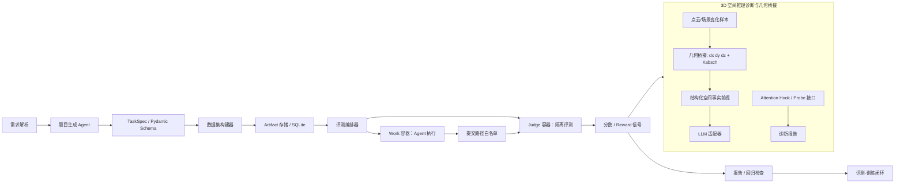

# SE-Bench AI Infra 复现项目技术文档

> 扩展复现设计请见 `docs/SE_BENCH_REPRODUCTION_TECH_DESIGN.md`。该 v2.5 文档补充了高引用文献优先级、GitHub 高赞成熟项目经验、缓存命中率/准确率/成本指标体系、Work/Judge 隔离、数据链路、P0/P1/P2 改造路线、真实评测闭环、Mac MLX/MPS 本地 benchmark 边界，以及 round2 toy true-loop、round3 仿真真实 repo、round4 patch submission、round5 并发 runner、round6 本地真实 git + hidden pytest worker sweep、round7 hidden pytest/filesystem I/O 诊断与 worktree 优化、round8 独立 repeat 稳定性 sweep 与生产 worker cap、round9 pytest plugin autoload 优化实测结果、round10 默认开启 pytest plugin autoload 加速后的复测结论、round11 pytest plugin dependency scan、round12 hard timeout/repo-affinity，以及 round13 shared cache/repo-shard/auto cache policy。成熟项目经验与性能优化的独立分析见 `docs/SE_BENCH_MATURE_PROJECT_OPTIMIZATION_ANALYSIS.md`，benchmark 摘要见 `docs/BENCHMARK_RESULTS.md`。

## 1. 项目定位

本项目复现的是一种公开可展示的 AI Infra 型 benchmark 工程系统，而不是任何公司内部实现。目标是把简历中的三个要点拆成可运行原型：

1. `SE-Bench` 风格长程 Agent 评测基准工程化。
2. benchmark authoring agent：从需求解析到题目生成、校验、迭代修复。
3. 3D 多模态空间推理诊断：用几何桥接模块把点云/场景变化转为 LLM 可读的结构化事实。

复现策略采用公开文献和成熟开源项目的模式借鉴：SWE-bench 的真实软件工程任务评测思想、AgentBench/WebArena 的多环境 agent 评测思想、SWE-agent 的 agent-computer interface 思想、3D-LLM/3D-LLava 的 3D 语言模型方向、ScanNet 的室内 3D 数据基准、LoRA/PEFT 的参数高效微调方案。

## 2. 技术选型

| 层级 | 选型 | 用途 | 原因 |
|---|---|---|---|
| 语言与工程 | Python 3.11/3.12 + uv | 依赖、CLI、服务、测试 | AI Infra 原型生态成熟，便于接入 LLM/HF/Docker |
| API | FastAPI | `/author`、`/evaluate`、健康检查 | 类型友好，自动 OpenAPI，适合评测平台服务化 |
| CLI | Typer | 本地复现实验命令 | 方便候选人/面试官快速跑通 demo |
| Schema | Pydantic v2 | `TaskSpec`、`DatasetSpec`、`EvaluationReport` | 用强类型约束题目、评分和报告，减少 benchmark 漂移 |
| 隔离执行 | Docker SDK + LocalSandbox | Work/Judge 隔离、路径白名单 | 本地默认可运行；Docker 模式预留安全隔离 |
| 存储 | SQLite | artifact store、run reports | 单机可复现，后续可迁移到 Postgres/对象存储 |
| LLM 推理 | Mock adapter + OpenAI-compatible adapter | authoring agent 与 vLLM 兼容 | 没有 key 也能跑；有 vLLM 时可切换真实模型 |
| 3D 计算 | NumPy/SciPy 路线 | 质心位移、Kabsch SVD | 几何模块可解释，不依赖大模型训练即可验证 |
| 微调预留 | Hugging Face Transformers + PEFT LoRA | 空间事实前缀/题目生成微调 | 用 LoRA 降低复现实验成本 |
| 可观测性 | JSON log + Prometheus + OpenTelemetry 预留 | latency、score、失败模式 | 让 benchmark 从脚本升级为平台能力 |

## 3. 模块架构



### 核心包划分

- `sebench_infra.authoring`：需求解析、LLM adapter、题目生成、schema 校验和修复。
- `sebench_infra.benchmark`：题目 schema、数据集构建、评分规则、回归门禁。
- `sebench_infra.orchestrator`：本地/Docker runner、Work/Judge 隔离、提交路径白名单。
- `sebench_infra.spatial`：质心位移、Kabsch 旋转、空间事实前缀、LoRA/Attention hook 占位。
- `sebench_infra.storage`：SQLite artifact store，记录 dataset 和 run report。

## 4. 数据流与接口约定

### 4.1 题目构建 Authoring

输入是一个公开复现需求：

```json
{
  "requirement": "复现 SE-Bench 长程 Agent 评测任务...",
  "references": ["https://arxiv.org/abs/2310.06770"]
}
```

输出是 `DatasetSpec`：

```json
{
  "dataset_id": "sebench-replica-<hash>",
  "version": "0.1.0",
  "source": "synthetic_public_reproduction",
  "tasks": ["TaskSpec..."],
  "references": ["public paper or repo URLs"]
}
```

### 4.2 评测 Evaluation

`EvaluationOrchestrator` 对每个 `TaskSpec` 执行：

1. 选择 `LocalSandbox` 或 `DockerSandbox`。
2. Work 环境生成提交。
3. `PathWhitelist` 丢弃不在 `allowed_paths` 内的 artifact。
4. `ScoreEngine` 按 `ScoringRule` 计算 task score。
5. 聚合为 `EvaluationReport`，并生成 reward signal。
6. `RegressionGate` 用最小分数阈值做回归检查。

### 4.3 3D 几何桥接 Geometry Bridge

输入是 synthetic ScanNet-style scene fixture：

```json
{
  "source_points": [[0, 0, 0], [1, 0, 0], "..."],
  "target_points": [[1, 2, 3], [1, 3, 3], "..."]
}
```

输出：

- `dx/dy/dz`：目标点云质心减源点云质心。
- `rotation_matrix`：Kabsch SVD 求得的 3D 旋转矩阵。
- `llm_prefix`：注入 LLM 的结构化空间事实，例如 `dx=1.0, dy=2.0, dz=3.0`。

## 5. 公开论文和开源项目映射

| 复现模块 | 对应公开参考 | 借鉴点 |
|---|---|---|
| 长程软件/工程任务评测 | SWE-bench | 真实 issue/task 风格、提交产物评测、可回归报告 |
| Agent 多环境评测 | AgentBench, WebArena | 隔离环境、任务协议、评测器独立于 agent |
| Agent-computer interface | SWE-agent | 让 agent 通过明确接口执行、观察、修复 |
| 3D 空间语言推理 | 3D-LLM, 3D-LLava | 把 3D 场景转换成语言模型可消费的信息 |
| 室内 3D 数据 | ScanNet | 使用室内场景/点云变换作为 synthetic fixture 设计依据 |
| 参数高效微调 | LoRA, PEFT | 用 rank=16 的 LoRA recipe 预留低成本微调入口 |
| 推理服务化 | vLLM OpenAI-compatible server | 统一 OpenAI-compatible LLM adapter |

## 6. 训练与实验复现建议

本仓库默认不下载大模型或私有数据。若要做更像论文的实验，可按以下公开路线扩展：

1. Dataset：从 Hugging Face 的 SWE-bench 数据集抽取小规模任务，或用公开 3D QA/ScanNet 派生数据构造空间推理样本。
2. Model：从 `Qwen/Qwen2.5-7B-Instruct` 或 `meta-llama/Llama-3.2-3B-Instruct` 开始；后者可能需要账号许可。
3. Fine-tuning：使用 `LoRARecipe(rank=16, alpha=32, dropout=0.05, lr=2e-4, epochs=3)` 作为小样本默认值。
4. Serving：用 vLLM 启动 OpenAI-compatible endpoint，然后配置 `SEBENCH_LLM_PROVIDER=openai_compatible`。
5. Metrics：记录 task pass rate、aggregate score、reward stability、runner latency、judge error rate。
6. Ablation：比较 `LLM-only`、`geometry-prefix`、`geometry-prefix + LoRA` 三组。

## 7. 测试方案

- Schema 单测：非法路径、缺失字段、默认 scoring rule。
- Path 单测：阻止绝对路径和 `..` 逃逸。
- Geometry 单测：已知 90 度旋转和位移下，Kabsch 矩阵与质心差分正确。
- Scoring 单测：`file_exists`、`contains`、`numeric_close`。
- Integration 测试：mock LLM 生成题目、构建 dataset、local runner 执行、输出 report。
- 文档验收：Mermaid 图可渲染，README 命令可执行，公开引用不声称内部细节。

## 8. 当前限制

- 没有内部 SE-Bench 论文、代码或数据，因此本项目是 public-paper-inspired replica。
- Docker runner 是可扩展骨架，本地测试默认用 `LocalSandbox`。
- 3D 模块使用 synthetic fixture，不等价于完整 3D 多模态模型训练。
- Attention hook 和 PEFT 训练代码保留接口，避免在无 GPU 环境中强行下载模型。

## 9. 参考链接

- SWE-bench paper: https://arxiv.org/abs/2310.06770
- SWE-bench dataset: https://huggingface.co/datasets/princeton-nlp/SWE-bench
- AgentBench: https://arxiv.org/abs/2308.03688
- WebArena: https://arxiv.org/abs/2307.13854
- SWE-agent: https://arxiv.org/abs/2405.15793
- 3D-LLM: https://arxiv.org/abs/2307.12981
- ScanNet: https://arxiv.org/abs/1702.04405
- LoRA: https://arxiv.org/abs/2106.09685
- vLLM serving docs: https://docs.vllm.ai/en/stable/serving/openai_compatible_server.html
- Hugging Face PEFT: https://huggingface.co/docs/peft/index
